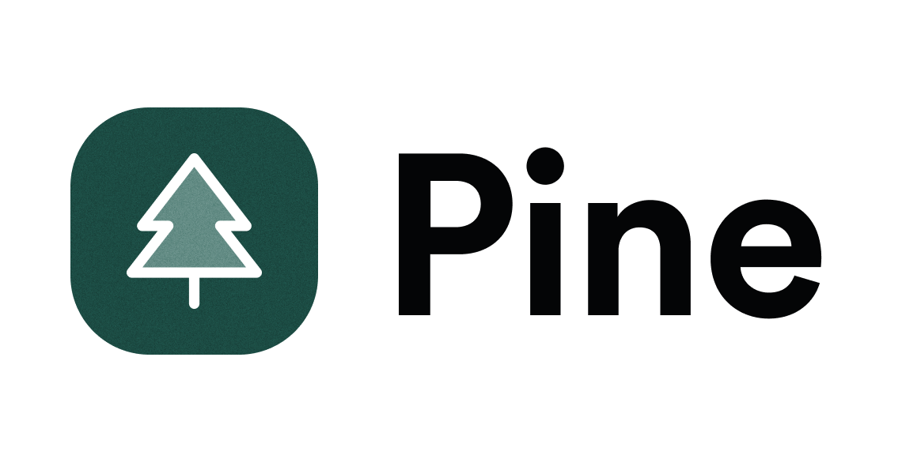

<picture>
  <source media="(prefers-color-scheme: dark)" srcset="./docs/assets/pine-logo-dark.png">
  <source media="(prefers-color-scheme: light)" srcset="./docs/assets/pine-logo.png">
  
</picture>

<h1 style="text-align: center;">Pine Design System</h1>

> Pine is a design system that includes the building blocks necessary to create beautiful and accessible user interfaces and experiences. Our library of tools comes with design tokens in the form of CSS custom properties and web components that can be added to any existing project. Created by Kajabi.

## Setup

Pine can be added to any project via CDN. Add the following link and script tags to the `<head>`:

```html
<link rel="stylesheet" href="https://cdn.jsdelivr.net/npm/@pine-ds/core[VERSION]/dist/pine-core/pine-core.css" />
<script type="module" src="https://cdn.jsdelivr.net/npm/@pine-ds/core[VERSION]/dist/pine-core/pine-core.esm.js"></script>
<script nomodule src="https://cdn.jsdelivr.net/npm/@pine-ds/core[VERSION]/dist/pine-core/index.esm.js"></script>
```

Replace `[VERSION]` with the desired version number. For example, version 2.0.0 can be accessed as `core@2.0.0`. If the latest version is desired, use `core@latest`.

## Usage

As Pine components are web components, they can be used as simply as any other HTML tag. For example, to add an accent button to the project, add the following:

```html
<pds-button variant="accent">Pine Button</pds-button>
```

For the full list of properties available for each component and more robust documentation, please see Pine's [Storybook](https://pine-design-system.netlify.app/)

## Contribution

To learn more about contributing to Pine, please see the [Contribution](./contribution.md) docs.
