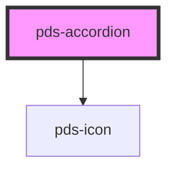

# pds-accordion

<!-- Auto Generated Below -->

## Properties

| Property      | Attribute      | Description                                                           | Type      | Default     |
| ------------- | -------------- | --------------------------------------------------------------------- | --------- | ----------- |
| `componentId` | `component-id` | A unique identifier used for the underlying component `id` attribute. | `string`  | `undefined` |
| `isOpen`      | `open`         | Can be used to manually set the open state of the accordion.          | `boolean` | `false`     |

## Slots

| Slot          | Description                       |
| ------------- | --------------------------------- |
| `"(default)"` | Accordion body content.           |
| `"label"`     | Accordion trigger button content. |

## Shadow Parts

| Part               | Description            |
| ------------------ | ---------------------- |
| `"accordion-body"` | Accordion body styles. |

## Dependencies

### Depends on

- pds-icon

### Graph

----------------------------------------------

