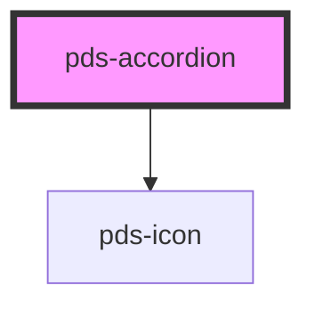

# pds-accordion

<!-- Auto Generated Below -->

## Properties

| Property      | Attribute      | Description                                                                                                                          | Type      | Default     |
| ------------- | -------------- | ------------------------------------------------------------------------------------------------------------------------------------ | --------- | ----------- |
| `componentId` | `component-id` | A unique identifier for this component instance. Does not set the host element's `id` attribute — set `id` directly if you need one. | `string`  | `undefined` |
| `isOpen`      | `open`         | Can be used to manually set the open state of the accordion.                                                                         | `boolean` | `false`     |

## Events

| Event                | Description                                    | Type                   |
| -------------------- | ---------------------------------------------- | ---------------------- |
| `pdsAccordionToggle` | Emitted when the accordion open state changes. | `CustomEvent<boolean>` |

## Slots

| Slot          | Description                       |
| ------------- | --------------------------------- |
| `"(default)"` | Accordion body content.           |
| `"label"`     | Accordion trigger button content. |

## Shadow Parts

| Part                 | Description                      |
| -------------------- | -------------------------------- |
| `"accordion-body"`   | Accordion body styles.           |
| `"accordion-button"` | Accordion button/trigger styles. |
| `"accordion-icon"`   | Accordion icon styles.           |

## Dependencies

### Depends on

- pds-icon

### Graph

```mermaid
graph TD;
  pds-accordion --> pds-icon
  style pds-accordion fill:#f9f,stroke:#333,stroke-width:4px
```

----------------------------------------------

