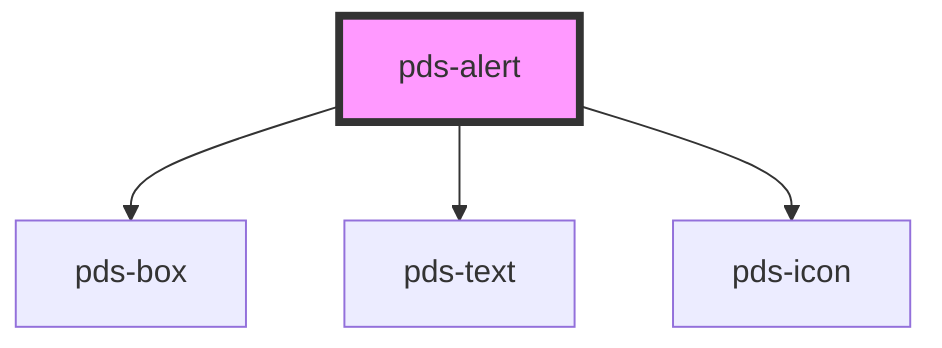

# pds-alert

<!-- Auto Generated Below -->

## Properties

| Property      | Attribute      | Description                                                                                                    | Type                                                        | Default     |
| ------------- | -------------- | -------------------------------------------------------------------------------------------------------------- | ----------------------------------------------------------- | ----------- |
| `componentId` | `component-id` | A unique identifier used for the underlying component `id` attribute.                                          | `string`                                                    | `undefined` |
| `dismissible` | `dismissible`  | If true, shows the dismiss button. If false, the dismiss button is hidden.                                     | `boolean`                                                   | `false`     |
| `heading`     | `heading`      | Text displayed as the heading of the alert.                                                                    | `string`                                                    | `undefined` |
| `small`       | `small`        | If true, the alert is displayed in a smaller size and description text is truncated. Heading is not displayed. | `boolean`                                                   | `false`     |
| `variant`     | `variant`      | Sets the style variant of the alert.                                                                           | `"danger" \| "default" \| "info" \| "success" \| "warning"` | `'default'` |

## Events

| Event                  | Description                                       | Type                |
| ---------------------- | ------------------------------------------------- | ------------------- |
| `pdsAlertDismissClick` | Event emitted when the dismiss button is clicked. | `CustomEvent<void>` |

## Slots

| Slot        | Description             |
| ----------- | ----------------------- |
| `"actions"` | Slot for alert actions. |

## Dependencies

### Depends on

- [pds-box](../pds-box)
- [pds-text](../pds-text)
- pds-icon

### Graph

----------------------------------------------

