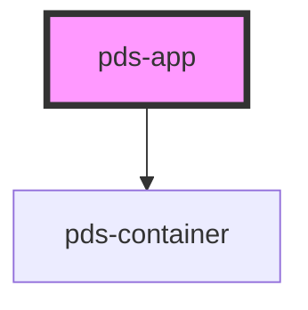

# pds-app

<!-- Auto Generated Below -->

## Properties

| Property      | Attribute      | Description                                                                                                                                                                                                       | Type     | Default     |
| ------------- | -------------- | ----------------------------------------------------------------------------------------------------------------------------------------------------------------------------------------------------------------- | -------- | ----------- |
| `componentId` | `component-id` | A unique identifier used for the underlying component `id` attribute.                                                                                                                                             | `string` | `undefined` |
| `mainSize`    | `main-size`    | Maximum width of the main content region. Accepts a named size token (`'sm'` \| `'md'` \| `'lg'` \| `'xl'` \| `'full'`, matching `pds-container`) or any valid CSS length. When omitted, no max-width is applied. | `string` | `undefined` |

## Slots

| Slot          | Description                                                                                   |
| ------------- | --------------------------------------------------------------------------------------------- |
| `"(default)"` | Scrollable main content.                                                                      |
| `"header"`    | Fixed top bar (typically a `pds-topbar`). Not scrolled with the page.                         |
| `"nav"`       | Optional side navigation / rail, alongside the main content. Collapses to nothing when empty. |

## Dependencies

### Depends on

- [pds-container](../pds-container)

### Graph

----------------------------------------------

