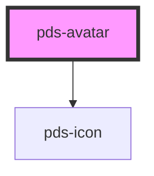

# pds-avatar

<!-- Auto Generated Below -->

## Properties

| Property      | Attribute      | Description                                                           | Type                    | Default      |
| ------------- | -------------- | --------------------------------------------------------------------- | ----------------------- | ------------ |
| `alt`         | `alt`          | The alt for a custom user image.                                      | `string`                | `null`       |
| `badge`       | `badge`        | Determines whether the badge is visible or not.                       | `boolean`               | `false`      |
| `componentId` | `component-id` | A unique identifier used for the underlying component `id` attribute. | `string`                | `undefined`  |
| `dropdown`    | `dropdown`     | Determines whether the avatar functions as a dropdown trigger.        | `boolean`               | `false`      |
| `image`       | `image`        | The src for a custom user image.                                      | `string`                | `null`       |
| `initials`    | `initials`     | The initials to display in the avatar when no image is provided.      | `string`                | `null`       |
| `size`        | `size`         | Size of the avatar. Value can be preset or custom.                    | `string`                | `'lg'`       |
| `variant`     | `variant`      | Determines the variant of avatar. Changes appearance accordingly.     | `"admin" \| "customer"` | `'customer'` |

## Shadow Parts

| Part              | Description                                                  |
| ----------------- | ------------------------------------------------------------ |
| `"asset-wrapper"` |                                                              |
| `"image"`         | The main image element that represents the avatar component. |

## Dependencies

### Depends on

- pds-icon

### Graph

----------------------------------------------

