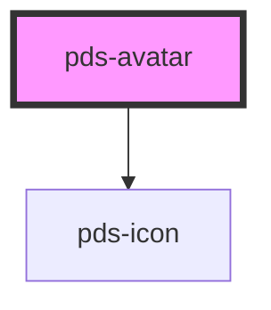

# pds-avatar

<!-- Auto Generated Below -->

## Properties

| Property  | Attribute | Description                                                                                         | Type                                   | Default      |
| --------- | --------- | --------------------------------------------------------------------------------------------------- | -------------------------------------- | ------------ |
| `alt`     | `alt`     | The alt for a custom user image.                                                                    | `string`                               | `undefined`  |
| `badge`   | `badge`   | Determines whether the badge is visible or not                                                      | `boolean`                              | `false`      |
| `image`   | `image`   | The src for a custom user image.                                                                    | `string`                               | `undefined`  |
| `size`    | `size`    | Preset sizes for the avatar. If a custom size is desired, use the `--size` custom property instead. | `"lg" \| "md" \| "sm" \| "xl" \| "xs"` | `undefined`  |
| `variant` | `variant` | Determines the variant of avatar. Changes appearance accordingly.                                   | `"admin" \| "customer"`                | `'customer'` |

## CSS Custom Properties

| Name     | Description           |
| -------- | --------------------- |
| `--size` | Custom size of avatar |

## Dependencies

### Depends on

- pds-icon

### Graph

----------------------------------------------

