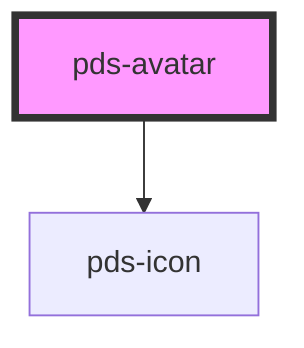

# pds-avatar

<!-- Auto Generated Below -->

## Properties

| Property  | Attribute | Description | Type                    | Default      |
| --------- | --------- | ----------- | ----------------------- | ------------ |
| `badge`   | `badge`   |             | `boolean`               | `false`      |
| `image`   | `image`   |             | `string`                | `undefined`  |
| `size`    | `size`    |             | `string`                | `undefined`  |
| `variant` | `variant` |             | `"admin" \| "customer"` | `'customer'` |

## Dependencies

### Depends on

- pds-icon

### Graph

----------------------------------------------

