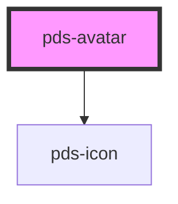

# pds-avatar

<!-- Auto Generated Below -->

## Properties

| Property   | Attribute  | Description                                                       | Type                    | Default      |
| ---------- | ---------- | ----------------------------------------------------------------- | ----------------------- | ------------ |
| `alt`      | `alt`      | The alt for a custom user image.                                  | `string`                | `undefined`  |
| `badge`    | `badge`    | Determines whether the badge is visible or not.                   | `boolean`               | `false`      |
| `dropdown` | `dropdown` | Determines whether the avatar functions as a dropdown trigger.    | `boolean`               | `false`      |
| `image`    | `image`    | The src for a custom user image.                                  | `string`                | `undefined`  |
| `size`     | `size`     | Size of the avatar. Value can be preset or custom.                | `string`                | `'lg'`       |
| `variant`  | `variant`  | Determines the variant of avatar. Changes appearance accordingly. | `"admin" \| "customer"` | `'customer'` |

## Dependencies

### Depends on

- pds-icon

### Graph

----------------------------------------------

