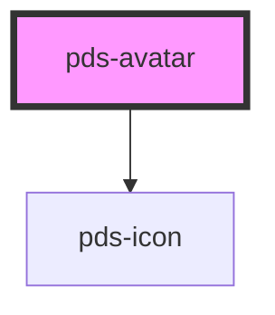

# pds-avatar

<!-- Auto Generated Below -->

## Properties

| Property       | Attribute       | Description                                                                                                                                                                                                                                                                                                                  | Type                              | Default                     |
| -------------- | --------------- | ---------------------------------------------------------------------------------------------------------------------------------------------------------------------------------------------------------------------------------------------------------------------------------------------------------------------------- | --------------------------------- | --------------------------- |
| `alt`          | `alt`           | The alt for a custom user image.                                                                                                                                                                                                                                                                                             | `string`                          | `null`                      |
| `badge`        | `badge`         | Determines whether the badge is visible or not.                                                                                                                                                                                                                                                                              | `boolean`                         | `false`                     |
| `componentId`  | `component-id`  | A unique identifier used for the underlying component `id` attribute.                                                                                                                                                                                                                                                        | `string`                          | `undefined`                 |
| `dropdown`     | `dropdown`      | Determines whether the avatar functions as a dropdown trigger.                                                                                                                                                                                                                                                               | `boolean`                         | `false`                     |
| `image`        | `image`         | The src for a custom user image.                                                                                                                                                                                                                                                                                             | `string`                          | `null`                      |
| `initials`     | `initials`      | The initials to display in the avatar when no image is provided.                                                                                                                                                                                                                                                             | `string`                          | `null`                      |
| `size`         | `size`          | Size of the avatar. Value can be preset or custom.                                                                                                                                                                                                                                                                           | `string`                          | `'lg'`                      |
| `status`       | `status`        | Displays a presence status indicator (a dot) on the avatar: `online` (success), `away` (warning), or `offline` (neutral). For a simple active/inactive presence, map active to `online` and inactive to `offline`. Takes precedence over `badge` — they share the same corner, so the badge is hidden while `status` is set. | `"away" \| "offline" \| "online"` | `null`                      |
| `statusLabel`  | `status-label`  | Accessible label for the presence status indicator. Pass a translated string to localize it; defaults to English (`"{status} status"`). Has no effect on dropdown avatars, where the trigger's `triggerLabel` owns the accessible name — fold presence into `triggerLabel` there.                                            | `string`                          | `undefined`                 |
| `statusRing`   | `status-ring`   | Determines whether a ring is shown around the avatar in the `status` color. Has no effect unless `status` is set.                                                                                                                                                                                                            | `boolean`                         | `false`                     |
| `triggerLabel` | `trigger-label` | Accessible label for the dropdown trigger button. Pass a translated string to localize it; defaults to English.                                                                                                                                                                                                              | `string`                          | `'Avatar dropdown trigger'` |
| `variant`      | `variant`       | Determines the variant of avatar. Changes appearance accordingly.                                                                                                                                                                                                                                                            | `"admin" \| "customer"`           | `'customer'`                |

## Shadow Parts

| Part              | Description                                                  |
| ----------------- | ------------------------------------------------------------ |
| `"asset-wrapper"` |                                                              |
| `"button"`        |                                                              |
| `"image"`         | The main image element that represents the avatar component. |
| `"status"`        |                                                              |

## Dependencies

### Depends on

- pds-icon

### Graph

```mermaid
graph TD;
  pds-avatar --> pds-icon
  style pds-avatar fill:#f9f,stroke:#333,stroke-width:4px
```

----------------------------------------------

