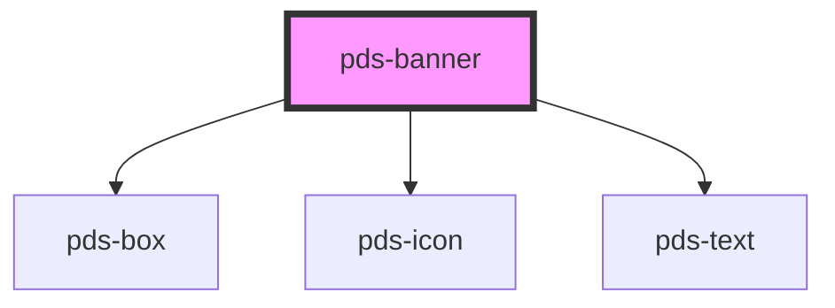

# pds-banner

<!-- Auto Generated Below -->

## Properties

| Property      | Attribute      | Description                                                           | Type                                                | Default     |
| ------------- | -------------- | --------------------------------------------------------------------- | --------------------------------------------------- | ----------- |
| `active`      | `active`       | Determines if the banner is active.                                   | `boolean`                                           | `false`     |
| `componentId` | `component-id` | A unique identifier used for the underlying component `id` attribute. | `string`                                            | `undefined` |
| `dismissable` | `dismissable`  | If true, displays a close button to dismiss the banner.               | `boolean`                                           | `false`     |
| `variant`     | `variant`      | Determines the banner variant.                                        | `"danger" \| "default" \| "secondary" \| "warning"` | `'default'` |

## Events

| Event                | Description                                     | Type                  |
| -------------------- | ----------------------------------------------- | --------------------- |
| `pdsBannerActivated` | Event emitted when a banner is currently active | `CustomEvent<string>` |
| `pdsDismiss`         | Event emitted when a banner is toggled          | `CustomEvent<any>`    |

## Dependencies

### Depends on

- [pds-box](../pds-box)
- pds-icon
- [pds-text](../pds-text)

### Graph

----------------------------------------------

