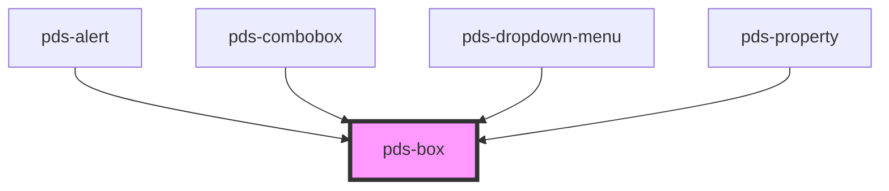

# pds-box

<!-- Auto Generated Below -->

## Properties

| Property               | Attribute                 | Description                                                                                                                                                                                        | Type                                                                                         | Default     |
| ---------------------- | ------------------------- | -------------------------------------------------------------------------------------------------------------------------------------------------------------------------------------------------- | -------------------------------------------------------------------------------------------- | ----------- |
| `alignItems`           | `align-items`             | Defines how items within the box are aligned.                                                                                                                                                      | `"baseline" \| "center" \| "end" \| "start" \| "stretch"`                                    | `undefined` |
| `alignItemsLg`         | `align-items-lg`          | Defines how items within the box are aligned at the LG breakpoint.                                                                                                                                 | `"baseline" \| "center" \| "end" \| "start" \| "stretch"`                                    | `undefined` |
| `alignItemsMd`         | `align-items-md`          | Defines how items within the box are aligned at the MD breakpoint.                                                                                                                                 | `"baseline" \| "center" \| "end" \| "start" \| "stretch"`                                    | `undefined` |
| `alignItemsSm`         | `align-items-sm`          | Defines how items within the box are aligned at the SM breakpoint.                                                                                                                                 | `"baseline" \| "center" \| "end" \| "start" \| "stretch"`                                    | `undefined` |
| `alignItemsXl`         | `align-items-xl`          | Defines how items within the box are aligned at the XL breakpoint.                                                                                                                                 | `"baseline" \| "center" \| "end" \| "start" \| "stretch"`                                    | `undefined` |
| `alignItemsXs`         | `align-items-xs`          | Defines how items within the box are aligned at the XS breakpoint.                                                                                                                                 | `"baseline" \| "center" \| "end" \| "start" \| "stretch"`                                    | `undefined` |
| `alignSelf`            | `align-self`              | Defines how the box is aligned within its container.                                                                                                                                               | `"baseline" \| "center" \| "end" \| "start" \| "stretch"`                                    | `undefined` |
| `alignSelfLg`          | `align-self-lg`           | Defines how the box is aligned within its container at the LG breakpoint.                                                                                                                          | `"baseline" \| "center" \| "end" \| "start" \| "stretch"`                                    | `undefined` |
| `alignSelfMd`          | `align-self-md`           | Defines how the box is aligned within its container at the MD breakpoint.                                                                                                                          | `"baseline" \| "center" \| "end" \| "start" \| "stretch"`                                    | `undefined` |
| `alignSelfSm`          | `align-self-sm`           | Defines how the box is aligned within its container at the SM breakpoint.                                                                                                                          | `"baseline" \| "center" \| "end" \| "start" \| "stretch"`                                    | `undefined` |
| `alignSelfXl`          | `align-self-xl`           | Defines how the box is aligned within its container at the XL breakpoint.                                                                                                                          | `"baseline" \| "center" \| "end" \| "start" \| "stretch"`                                    | `undefined` |
| `alignSelfXs`          | `align-self-xs`           | Defines how the box is aligned within its container at the XS breakpoint.                                                                                                                          | `"baseline" \| "center" \| "end" \| "start" \| "stretch"`                                    | `undefined` |
| `auto`                 | `auto`                    | If `true`, the box will be sized to fit its contents.                                                                                                                                              | `boolean`                                                                                    | `undefined` |
| `autoLg`               | `auto-lg`                 | If `true`, the box will be sized to fit its contents at the LG breakpoint.                                                                                                                         | `boolean`                                                                                    | `undefined` |
| `autoMd`               | `auto-md`                 | If `true`, the box will be sized to fit its contents at the MD breakpoint.                                                                                                                         | `boolean`                                                                                    | `undefined` |
| `autoSm`               | `auto-sm`                 | If `true`, the box will be sized to fit its contents at the SM breakpoint.                                                                                                                         | `boolean`                                                                                    | `undefined` |
| `autoXl`               | `auto-xl`                 | If `true`, the box will be sized to fit its contents at the XL breakpoint.                                                                                                                         | `boolean`                                                                                    | `undefined` |
| `autoXs`               | `auto-xs`                 | If `true`, the box will be sized to fit its contents at the XS breakpoint.                                                                                                                         | `boolean`                                                                                    | `undefined` |
| `backgroundColor`      | `background-color`        | Defines the background-color of the box.                                                                                                                                                           | `string`                                                                                     | `undefined` |
| `border`               | `border`                  | If `true`, the box will have a border.                                                                                                                                                             | `boolean`                                                                                    | `false`     |
| `borderColor`          | `border-color`            | Defines the border color of the box.                                                                                                                                                               | `string`                                                                                     | `undefined` |
| `borderRadius`         | `border-radius`           | Defines how rounded the box corners are.                                                                                                                                                           | `"circle" \| "lg" \| "md" \| "none" \| "sm" \| "xs"`                                         | `undefined` |
| `direction`            | `direction`               | Defines the orientation of the box items.                                                                                                                                                          | `"column" \| "row"`                                                                          | `undefined` |
| `display`              | `display`                 | Defines the display style of the box.                                                                                                                                                              | `"block" \| "flex" \| "inline-block" \| "inline-flex"`                                       | `undefined` |
| `fit`                  | `fit`                     | If `true`, sets the box `max-width` to `100%`.                                                                                                                                                     | `boolean`                                                                                    | `undefined` |
| `fitLg`                | `fit-lg`                  | If `true`, sets the box `max-width` to `100%` at the LG breakpoint.                                                                                                                                | `boolean`                                                                                    | `undefined` |
| `fitMd`                | `fit-md`                  | If `true`, sets the box `max-width` to `100%` at the MD breakpoint.                                                                                                                                | `boolean`                                                                                    | `undefined` |
| `fitSm`                | `fit-sm`                  | If `true`, sets the box `max-width` to `100%` at the SM breakpoint.                                                                                                                                | `boolean`                                                                                    | `undefined` |
| `fitXl`                | `fit-xl`                  | If `true`, sets the box `max-width` to `100%` at the XL breakpoint.                                                                                                                                | `boolean`                                                                                    | `undefined` |
| `fitXs`                | `fit-xs`                  | If `true`, sets the box `max-width` to `100%` at the XS breakpoint.                                                                                                                                | `boolean`                                                                                    | `undefined` |
| `flex`                 | `flex`                    | Defines how a box will grow or shrink to fit the space available in its container. Can be a predefined value ('none', 'grow', 'shrink') or a custom flex value (e.g., '1', '0 1 auto').            | `string`                                                                                     | `undefined` |
| `gap`                  | `gap`                     | Defines the spacing between the box items.                                                                                                                                                         | `"lg" \| "md" \| "none" \| "sm" \| "xl" \| "xs" \| "xxl" \| "xxs"`                           | `undefined` |
| `gapLg`                | `gap-lg`                  | Defines the spacing between the box items at the LG breakpoint.                                                                                                                                    | `"lg" \| "md" \| "none" \| "sm" \| "xl" \| "xs" \| "xxl" \| "xxs"`                           | `undefined` |
| `gapMd`                | `gap-md`                  | Defines the spacing between the box items at the MD breakpoint.                                                                                                                                    | `"lg" \| "md" \| "none" \| "sm" \| "xl" \| "xs" \| "xxl" \| "xxs"`                           | `undefined` |
| `gapSm`                | `gap-sm`                  | Defines the spacing between the box items at the SM breakpoint.                                                                                                                                    | `"lg" \| "md" \| "none" \| "sm" \| "xl" \| "xs" \| "xxl" \| "xxs"`                           | `undefined` |
| `gapXl`                | `gap-xl`                  | Defines the spacing between the box items at the XL breakpoint.                                                                                                                                    | `"lg" \| "md" \| "none" \| "sm" \| "xl" \| "xs" \| "xxl" \| "xxs"`                           | `undefined` |
| `gapXs`                | `gap-xs`                  | Defines the spacing between the box items at the XS breakpoint.                                                                                                                                    | `"lg" \| "md" \| "none" \| "sm" \| "xl" \| "xs" \| "xxl" \| "xxs"`                           | `undefined` |
| `justifyContent`       | `justify-content`         | Defines the horizontal alignment of the box items.                                                                                                                                                 | `"center" \| "end" \| "space-around" \| "space-between" \| "space-evenly" \| "start"`        | `undefined` |
| `justifyContentLg`     | `justify-content-lg`      | Defines the horizontal alignment of the box items at the LG breakpoint.                                                                                                                            | `"center" \| "end" \| "space-around" \| "space-between" \| "space-evenly" \| "start"`        | `undefined` |
| `justifyContentMd`     | `justify-content-md`      | Defines the horizontal alignment of the box items at the MD breakpoint.                                                                                                                            | `"center" \| "end" \| "space-around" \| "space-between" \| "space-evenly" \| "start"`        | `undefined` |
| `justifyContentSm`     | `justify-content-sm`      | Defines the horizontal alignment of the box items at the SM breakpoint.                                                                                                                            | `"center" \| "end" \| "space-around" \| "space-between" \| "space-evenly" \| "start"`        | `undefined` |
| `justifyContentXl`     | `justify-content-xl`      | Defines the horizontal alignment of the box items at the XL breakpoint.                                                                                                                            | `"center" \| "end" \| "space-around" \| "space-between" \| "space-evenly" \| "start"`        | `undefined` |
| `justifyContentXs`     | `justify-content-xs`      | Defines the horizontal alignment of the box items at the XS breakpoint.                                                                                                                            | `"center" \| "end" \| "space-around" \| "space-between" \| "space-evenly" \| "start"`        | `undefined` |
| `marginBlockEnd`       | `margin-block-end`        | Defines the box's outer bottom spacing.                                                                                                                                                            | `"lg" \| "md" \| "none" \| "sm" \| "xl" \| "xs" \| "xxl" \| "xxs"`                           | `undefined` |
| `marginBlockEndLg`     | `margin-block-end-lg`     | Defines the box's outer bottom spacing at the LG breakpoint.                                                                                                                                       | `"lg" \| "md" \| "none" \| "sm" \| "xl" \| "xs" \| "xxl" \| "xxs"`                           | `undefined` |
| `marginBlockEndMd`     | `margin-block-end-md`     | Defines the box's outer bottom spacing at the MD breakpoint.                                                                                                                                       | `"lg" \| "md" \| "none" \| "sm" \| "xl" \| "xs" \| "xxl" \| "xxs"`                           | `undefined` |
| `marginBlockEndSm`     | `margin-block-end-sm`     | Defines the box's outer bottom spacing at the SM breakpoint.                                                                                                                                       | `"lg" \| "md" \| "none" \| "sm" \| "xl" \| "xs" \| "xxl" \| "xxs"`                           | `undefined` |
| `marginBlockEndXl`     | `margin-block-end-xl`     | Defines the box's outer bottom spacing at the XL breakpoint.                                                                                                                                       | `"lg" \| "md" \| "none" \| "sm" \| "xl" \| "xs" \| "xxl" \| "xxs"`                           | `undefined` |
| `marginBlockEndXs`     | `margin-block-end-xs`     | Defines the box's outer bottom spacing at the XS breakpoint.                                                                                                                                       | `"lg" \| "md" \| "none" \| "sm" \| "xl" \| "xs" \| "xxl" \| "xxs"`                           | `undefined` |
| `marginBlockStart`     | `margin-block-start`      | Defines the box's outer top spacing.                                                                                                                                                               | `"lg" \| "md" \| "none" \| "sm" \| "xl" \| "xs" \| "xxl" \| "xxs"`                           | `undefined` |
| `marginBlockStartLg`   | `margin-block-start-lg`   | Defines the box's outer top spacing at the LG breakpoint.                                                                                                                                          | `"lg" \| "md" \| "none" \| "sm" \| "xl" \| "xs" \| "xxl" \| "xxs"`                           | `undefined` |
| `marginBlockStartMd`   | `margin-block-start-md`   | Defines the box's outer top spacing at the MD breakpoint.                                                                                                                                          | `"lg" \| "md" \| "none" \| "sm" \| "xl" \| "xs" \| "xxl" \| "xxs"`                           | `undefined` |
| `marginBlockStartSm`   | `margin-block-start-sm`   | Defines the box's outer top spacing at the SM breakpoint.                                                                                                                                          | `"lg" \| "md" \| "none" \| "sm" \| "xl" \| "xs" \| "xxl" \| "xxs"`                           | `undefined` |
| `marginBlockStartXl`   | `margin-block-start-xl`   | Defines the box's outer top spacing at the XL breakpoint.                                                                                                                                          | `"lg" \| "md" \| "none" \| "sm" \| "xl" \| "xs" \| "xxl" \| "xxs"`                           | `undefined` |
| `marginBlockStartXs`   | `margin-block-start-xs`   | Defines the box's outer top spacing at the XS breakpoint.                                                                                                                                          | `"lg" \| "md" \| "none" \| "sm" \| "xl" \| "xs" \| "xxl" \| "xxs"`                           | `undefined` |
| `marginInlineEnd`      | `margin-inline-end`       | Defines the box's outer right spacing.                                                                                                                                                             | `"lg" \| "md" \| "none" \| "sm" \| "xl" \| "xs" \| "xxl" \| "xxs"`                           | `undefined` |
| `marginInlineEndLg`    | `margin-inline-end-lg`    | Defines the box's outer right spacing at the LG breakpoint.                                                                                                                                        | `"lg" \| "md" \| "none" \| "sm" \| "xl" \| "xs" \| "xxl" \| "xxs"`                           | `undefined` |
| `marginInlineEndMd`    | `margin-inline-end-md`    | Defines the box's outer right spacing at the MD breakpoint.                                                                                                                                        | `"lg" \| "md" \| "none" \| "sm" \| "xl" \| "xs" \| "xxl" \| "xxs"`                           | `undefined` |
| `marginInlineEndSm`    | `margin-inline-end-sm`    | Defines the box's outer right spacing at the SM breakpoint.                                                                                                                                        | `"lg" \| "md" \| "none" \| "sm" \| "xl" \| "xs" \| "xxl" \| "xxs"`                           | `undefined` |
| `marginInlineEndXl`    | `margin-inline-end-xl`    | Defines the box's outer right spacing at the XL breakpoint.                                                                                                                                        | `"lg" \| "md" \| "none" \| "sm" \| "xl" \| "xs" \| "xxl" \| "xxs"`                           | `undefined` |
| `marginInlineEndXs`    | `margin-inline-end-xs`    | Defines the box's outer right spacing at the XS breakpoint.                                                                                                                                        | `"lg" \| "md" \| "none" \| "sm" \| "xl" \| "xs" \| "xxl" \| "xxs"`                           | `undefined` |
| `marginInlineStart`    | `margin-inline-start`     | Defines the box's outer left spacing.                                                                                                                                                              | `"lg" \| "md" \| "none" \| "sm" \| "xl" \| "xs" \| "xxl" \| "xxs"`                           | `undefined` |
| `marginInlineStartLg`  | `margin-inline-start-lg`  | Defines the box's outer left spacing at the LG breakpoint.                                                                                                                                         | `"lg" \| "md" \| "none" \| "sm" \| "xl" \| "xs" \| "xxl" \| "xxs"`                           | `undefined` |
| `marginInlineStartMd`  | `margin-inline-start-md`  | Defines the box's outer left spacing at the MD breakpoint.                                                                                                                                         | `"lg" \| "md" \| "none" \| "sm" \| "xl" \| "xs" \| "xxl" \| "xxs"`                           | `undefined` |
| `marginInlineStartSm`  | `margin-inline-start-sm`  | Defines the box's outer left spacing at the SM breakpoint.                                                                                                                                         | `"lg" \| "md" \| "none" \| "sm" \| "xl" \| "xs" \| "xxl" \| "xxs"`                           | `undefined` |
| `marginInlineStartXl`  | `margin-inline-start-xl`  | Defines the box's outer left spacing at the XL breakpoint.                                                                                                                                         | `"lg" \| "md" \| "none" \| "sm" \| "xl" \| "xs" \| "xxl" \| "xxs"`                           | `undefined` |
| `marginInlineStartXs`  | `margin-inline-start-xs`  | Defines the box's outer left spacing at the XS breakpoint.                                                                                                                                         | `"lg" \| "md" \| "none" \| "sm" \| "xl" \| "xs" \| "xxl" \| "xxs"`                           | `undefined` |
| `minHeight`            | `min-height`              | The minimum height of the row. Used in conjunction with alignment props                                                                                                                            | `string`                                                                                     | `undefined` |
| `minWidth`             | `min-width`               | The minimum width of the row. Used in conjunction with alignment props                                                                                                                             | `string`                                                                                     | `undefined` |
| `offset`               | `offset`                  | Move columns to the end direction of the row for all screen sizes. Increases the starting margin of a column by specified number of columns.                                                       | `"0" \| "1" \| "10" \| "11" \| "12" \| "2" \| "3" \| "4" \| "5" \| "6" \| "7" \| "8" \| "9"` | `undefined` |
| `offsetLg`             | `offset-lg`               | Move columns to the end direction of the row for `LG` screen sizes. Increases the starting margin of a column by specified number of columns.                                                      | `"0" \| "1" \| "10" \| "11" \| "12" \| "2" \| "3" \| "4" \| "5" \| "6" \| "7" \| "8" \| "9"` | `undefined` |
| `offsetMd`             | `offset-md`               | Move columns to the end direction of the row for `MD` screen sizes. Increases the starting margin of a column by specified number of columns.                                                      | `"0" \| "1" \| "10" \| "11" \| "12" \| "2" \| "3" \| "4" \| "5" \| "6" \| "7" \| "8" \| "9"` | `undefined` |
| `offsetSm`             | `offset-sm`               | Move columns to the end direction of the row for `SM` screen sizes. Increases the starting margin of a column by specified number of columns.                                                      | `"0" \| "1" \| "10" \| "11" \| "12" \| "2" \| "3" \| "4" \| "5" \| "6" \| "7" \| "8" \| "9"` | `undefined` |
| `offsetXl`             | `offset-xl`               | Move columns to the end direction of the row for `XL` screen sizes. Increases the starting margin of a column by specified number of columns.                                                      | `"0" \| "1" \| "10" \| "11" \| "12" \| "2" \| "3" \| "4" \| "5" \| "6" \| "7" \| "8" \| "9"` | `undefined` |
| `offsetXs`             | `offset-xs`               | Move columns to the end direction of the row for `XS` screen sizes. Increases the starting margin of a column by specified number of columns.                                                      | `"0" \| "1" \| "10" \| "11" \| "12" \| "2" \| "3" \| "4" \| "5" \| "6" \| "7" \| "8" \| "9"` | `undefined` |
| `padding`              | `padding`                 | Defines the spacing between the box items.                                                                                                                                                         | `"lg" \| "md" \| "none" \| "sm" \| "xl" \| "xs" \| "xxl" \| "xxs"`                           | `undefined` |
| `paddingBlockEnd`      | `padding-block-end`       | Defines the bottom spacing.                                                                                                                                                                        | `"lg" \| "md" \| "none" \| "sm" \| "xl" \| "xs" \| "xxl" \| "xxs"`                           | `undefined` |
| `paddingBlockEndLg`    | `padding-block-end-lg`    | Defines the bottom spacing at the LG breakpoint.                                                                                                                                                   | `"lg" \| "md" \| "none" \| "sm" \| "xl" \| "xs" \| "xxl" \| "xxs"`                           | `undefined` |
| `paddingBlockEndMd`    | `padding-block-end-md`    | Defines the bottom spacing at the MD breakpoint.                                                                                                                                                   | `"lg" \| "md" \| "none" \| "sm" \| "xl" \| "xs" \| "xxl" \| "xxs"`                           | `undefined` |
| `paddingBlockEndSm`    | `padding-block-end-sm`    | Defines the bottom spacing at the SM breakpoint.                                                                                                                                                   | `"lg" \| "md" \| "none" \| "sm" \| "xl" \| "xs" \| "xxl" \| "xxs"`                           | `undefined` |
| `paddingBlockEndXl`    | `padding-block-end-xl`    | Defines the bottom spacing at the XL breakpoint.                                                                                                                                                   | `"lg" \| "md" \| "none" \| "sm" \| "xl" \| "xs" \| "xxl" \| "xxs"`                           | `undefined` |
| `paddingBlockEndXs`    | `padding-block-end-xs`    | Defines the bottom spacing at the XS breakpoint.                                                                                                                                                   | `"lg" \| "md" \| "none" \| "sm" \| "xl" \| "xs" \| "xxl" \| "xxs"`                           | `undefined` |
| `paddingBlockStart`    | `padding-block-start`     | Defines the top spacing.                                                                                                                                                                           | `"lg" \| "md" \| "none" \| "sm" \| "xl" \| "xs" \| "xxl" \| "xxs"`                           | `undefined` |
| `paddingBlockStartLg`  | `padding-block-start-lg`  | Defines the top spacing at the LG breakpoint.                                                                                                                                                      | `"lg" \| "md" \| "none" \| "sm" \| "xl" \| "xs" \| "xxl" \| "xxs"`                           | `undefined` |
| `paddingBlockStartMd`  | `padding-block-start-md`  | Defines the top spacing at the MD breakpoint.                                                                                                                                                      | `"lg" \| "md" \| "none" \| "sm" \| "xl" \| "xs" \| "xxl" \| "xxs"`                           | `undefined` |
| `paddingBlockStartSm`  | `padding-block-start-sm`  | Defines the top spacing at the SM breakpoint.                                                                                                                                                      | `"lg" \| "md" \| "none" \| "sm" \| "xl" \| "xs" \| "xxl" \| "xxs"`                           | `undefined` |
| `paddingBlockStartXl`  | `padding-block-start-xl`  | Defines the top spacing at the XL breakpoint.                                                                                                                                                      | `"lg" \| "md" \| "none" \| "sm" \| "xl" \| "xs" \| "xxl" \| "xxs"`                           | `undefined` |
| `paddingBlockStartXs`  | `padding-block-start-xs`  | Defines the top spacing at the XS breakpoint.                                                                                                                                                      | `"lg" \| "md" \| "none" \| "sm" \| "xl" \| "xs" \| "xxl" \| "xxs"`                           | `undefined` |
| `paddingInlineEnd`     | `padding-inline-end`      | Defines the right spacing.                                                                                                                                                                         | `"lg" \| "md" \| "none" \| "sm" \| "xl" \| "xs" \| "xxl" \| "xxs"`                           | `undefined` |
| `paddingInlineEndLg`   | `padding-inline-end-lg`   | Defines the right spacing at the LG breakpoint.                                                                                                                                                    | `"lg" \| "md" \| "none" \| "sm" \| "xl" \| "xs" \| "xxl" \| "xxs"`                           | `undefined` |
| `paddingInlineEndMd`   | `padding-inline-end-md`   | Defines the right spacing at the MD breakpoint.                                                                                                                                                    | `"lg" \| "md" \| "none" \| "sm" \| "xl" \| "xs" \| "xxl" \| "xxs"`                           | `undefined` |
| `paddingInlineEndSm`   | `padding-inline-end-sm`   | Defines the right spacing at the SM breakpoint.                                                                                                                                                    | `"lg" \| "md" \| "none" \| "sm" \| "xl" \| "xs" \| "xxl" \| "xxs"`                           | `undefined` |
| `paddingInlineEndXl`   | `padding-inline-end-xl`   | Defines the right spacing at the XL breakpoint.                                                                                                                                                    | `"lg" \| "md" \| "none" \| "sm" \| "xl" \| "xs" \| "xxl" \| "xxs"`                           | `undefined` |
| `paddingInlineEndXs`   | `padding-inline-end-xs`   | Defines the right spacing at the XS breakpoint.                                                                                                                                                    | `"lg" \| "md" \| "none" \| "sm" \| "xl" \| "xs" \| "xxl" \| "xxs"`                           | `undefined` |
| `paddingInlineStart`   | `padding-inline-start`    | Defines the left spacing.                                                                                                                                                                          | `"lg" \| "md" \| "none" \| "sm" \| "xl" \| "xs" \| "xxl" \| "xxs"`                           | `undefined` |
| `paddingInlineStartLg` | `padding-inline-start-lg` | Defines the left spacing at the LG breakpoint.                                                                                                                                                     | `"lg" \| "md" \| "none" \| "sm" \| "xl" \| "xs" \| "xxl" \| "xxs"`                           | `undefined` |
| `paddingInlineStartMd` | `padding-inline-start-md` | Defines the left spacing at the MD breakpoint.                                                                                                                                                     | `"lg" \| "md" \| "none" \| "sm" \| "xl" \| "xs" \| "xxl" \| "xxs"`                           | `undefined` |
| `paddingInlineStartSm` | `padding-inline-start-sm` | Defines the left spacing at the SM breakpoint.                                                                                                                                                     | `"lg" \| "md" \| "none" \| "sm" \| "xl" \| "xs" \| "xxl" \| "xxs"`                           | `undefined` |
| `paddingInlineStartXl` | `padding-inline-start-xl` | Defines the left spacing at the XL breakpoint.                                                                                                                                                     | `"lg" \| "md" \| "none" \| "sm" \| "xl" \| "xs" \| "xxl" \| "xxs"`                           | `undefined` |
| `paddingInlineStartXs` | `padding-inline-start-xs` | Defines the left spacing at the XS breakpoint.                                                                                                                                                     | `"lg" \| "md" \| "none" \| "sm" \| "xl" \| "xs" \| "xxl" \| "xxs"`                           | `undefined` |
| `paddingLg`            | `padding-lg`              | Defines the spacing between the box items at the LG breakpoint.                                                                                                                                    | `"lg" \| "md" \| "none" \| "sm" \| "xl" \| "xs" \| "xxl" \| "xxs"`                           | `undefined` |
| `paddingMd`            | `padding-md`              | Defines the spacing between the box items at the MD breakpoint.                                                                                                                                    | `"lg" \| "md" \| "none" \| "sm" \| "xl" \| "xs" \| "xxl" \| "xxs"`                           | `undefined` |
| `paddingSm`            | `padding-sm`              | Defines the spacing between the box items at the SM breakpoint.                                                                                                                                    | `"lg" \| "md" \| "none" \| "sm" \| "xl" \| "xs" \| "xxl" \| "xxs"`                           | `undefined` |
| `paddingXl`            | `padding-xl`              | Defines the spacing between the box items at the XL breakpoint.                                                                                                                                    | `"lg" \| "md" \| "none" \| "sm" \| "xl" \| "xs" \| "xxl" \| "xxs"`                           | `undefined` |
| `paddingXs`            | `padding-xs`              | Defines the spacing between the box items at the XS breakpoint.                                                                                                                                    | `"lg" \| "md" \| "none" \| "sm" \| "xl" \| "xs" \| "xxl" \| "xxs"`                           | `undefined` |
| `shadow`               | `shadow`                  | Defines the box shadow.                                                                                                                                                                            | `"050" \| "100" \| "150" \| "200" \| "300" \| "400" \| "500" \| "none"`                      | `undefined` |
| `size`                 | `size`                    | Sets the default column width for the component. This value applies from the smallest screen size (XS) upwards, unless overridden by a breakpoint-specific size prop at that breakpoint or larger. | `"0" \| "1" \| "10" \| "11" \| "12" \| "2" \| "3" \| "4" \| "5" \| "6" \| "7" \| "8" \| "9"` | `undefined` |
| `sizeLg`               | `size-lg`                 | At screen sizes from the LG breakpoint and larger (992px and up), this will take the specified number of columns. This overrides any value set by size, sizeXs, and up.                            | `"0" \| "1" \| "10" \| "11" \| "12" \| "2" \| "3" \| "4" \| "5" \| "6" \| "7" \| "8" \| "9"` | `undefined` |
| `sizeMd`               | `size-md`                 | At screen sizes from the MD breakpoint and larger (768px and up), this will take the specified number of columns. This overrides any value set by size, sizeXs, and up.                            | `"0" \| "1" \| "10" \| "11" \| "12" \| "2" \| "3" \| "4" \| "5" \| "6" \| "7" \| "8" \| "9"` | `undefined` |
| `sizeSm`               | `size-sm`                 | At screen sizes from the SM breakpoint and larger (576px and up), this will take the specified number of columns. This overrides any value set by size or sizeXs.                                  | `"0" \| "1" \| "10" \| "11" \| "12" \| "2" \| "3" \| "4" \| "5" \| "6" \| "7" \| "8" \| "9"` | `undefined` |
| `sizeXl`               | `size-xl`                 | At screen sizes from the XL breakpoint and larger (1200px and up), this will take the specified number of columns. This overrides any value set by size, sizeXs, and up.                           | `"0" \| "1" \| "10" \| "11" \| "12" \| "2" \| "3" \| "4" \| "5" \| "6" \| "7" \| "8" \| "9"` | `undefined` |
| `sizeXs`               | `size-xs`                 | At the XS breakpoint, this prop will take the number of columns specified. This overrides the base size prop for this specific range.                                                              | `"0" \| "1" \| "10" \| "11" \| "12" \| "2" \| "3" \| "4" \| "5" \| "6" \| "7" \| "8" \| "9"` | `undefined` |
| `wrap`                 | `wrap`                    | Defines whether flex items are forced onto one line or can wrap onto multiple lines.                                                                                                               | `boolean`                                                                                    | `undefined` |
| `wrapLg`               | `wrap-lg`                 | Defines whether flex items can wrap onto multiple lines at the LG breakpoint.                                                                                                                      | `boolean`                                                                                    | `undefined` |
| `wrapMd`               | `wrap-md`                 | Defines whether flex items can wrap onto multiple lines at the MD breakpoint.                                                                                                                      | `boolean`                                                                                    | `undefined` |
| `wrapSm`               | `wrap-sm`                 | Defines whether flex items can wrap onto multiple lines at the SM breakpoint.                                                                                                                      | `boolean`                                                                                    | `undefined` |
| `wrapXl`               | `wrap-xl`                 | Defines whether flex items can wrap onto multiple lines at the XL breakpoint.                                                                                                                      | `boolean`                                                                                    | `undefined` |
| `wrapXs`               | `wrap-xs`                 | Defines whether flex items can wrap onto multiple lines at the XS breakpoint.                                                                                                                      | `boolean`                                                                                    | `undefined` |

## Dependencies

### Used by

 - [pds-alert](../pds-alert)
 - [pds-combobox](../pds-combobox)
 - [pds-dropdown-menu](../pds-dropdown-menu)
 - [pds-property](../pds-property)

### Graph

----------------------------------------------

