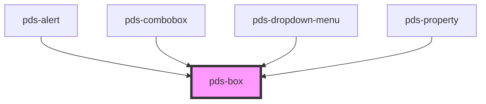

# pds-box


<!-- Auto Generated Below -->


## Overview

PdsBox - A flexible layout container component

**⚠️ CRITICAL LAYOUT BEHAVIOR:**
- **Default Direction**: Items flow HORIZONTALLY by default (`direction="row"`)
- **For Vertical Stacking**: You MUST explicitly set `direction="column"`
- **Common Mistake**: Expecting vertical stacking without setting direction

**Layout Patterns:**
- **Horizontal Flow (Default)**: Items are placed side by side
- **Vertical Stacking**: Set `direction="column"` for items to stack vertically
- **Main Containers**: Always use `direction="column"` and `fit="true"` for page sections and main content areas
- **Grid Layout**: Use inside `pds-row` with `size-*` props for responsive grid

**Key Props for Layout:**
- `direction`: **CRITICAL** - Controls item orientation (`row` = horizontal, `column` = vertical)
- `size`: Sets column width (1-12 grid system, works best inside pds-row)
- `gap`: Controls spacing between items
- `justifyContent`: Horizontal alignment of items
- `alignItems`: Vertical alignment of items

**Usage Examples:**
```tsx
// ⚠️ HORIZONTAL flow (default behavior - items side by side)
<pds-box gap="md">
  <div>Item 1</div>
  <div>Item 2</div> // These will be HORIZONTAL
</pds-box>

// ✅ VERTICAL stacking (explicit - items stacked)
<pds-box direction="column" gap="md">
  <div>Item 1</div>
  <div>Item 2</div> // These will be VERTICAL
</pds-box>

// ✅ MAIN CONTAINERS should use direction="column" and fit="true"
<pds-box direction="column" gap="lg" fit="true">
  <h1>Page Title</h1>
  <p>Page description</p>
  <pds-box direction="row" gap="md">
    <pds-button>Action 1</pds-button>
    <pds-button variant="secondary">Action 2</pds-button>
  </pds-box>
</pds-box>

// Grid layout inside pds-row
<pds-row>
  <pds-box size-md="6">Half width</pds-box>
  <pds-box size-md="6">Half width</pds-box>
</pds-row>
```

## Properties

| Property             | Attribute              | Description                                                                                                                                                                                                                                                                                                                                                                                                                                                                                                                                                                                                                                                                                    | Type                                                                                         | Default     |
| -------------------- | ---------------------- | ---------------------------------------------------------------------------------------------------------------------------------------------------------------------------------------------------------------------------------------------------------------------------------------------------------------------------------------------------------------------------------------------------------------------------------------------------------------------------------------------------------------------------------------------------------------------------------------------------------------------------------------------------------------------------------------------- | -------------------------------------------------------------------------------------------- | ----------- |
| `alignItems`         | `align-items`          | Defines how items within the box are aligned.  **Layout Impact:** - `start`: Items align to the start (top for column, left for row) - `center`: Items align to the center - `end`: Items align to the end (bottom for column, right for row) - `baseline`: Items align to their text baseline - `stretch`: Items stretch to fill the container (default)                                                                                                                                                                                                                                                                                                                                      | `"baseline" \| "center" \| "end" \| "start" \| "stretch"`                                    | `undefined` |
| `alignSelf`          | `align-self`           | Defines how the box is aligned within its container.                                                                                                                                                                                                                                                                                                                                                                                                                                                                                                                                                                                                                                           | `"baseline" \| "center" \| "end" \| "start" \| "stretch"`                                    | `undefined` |
| `auto`               | `auto`                 | If `true`, the box will be sized to fit its contents.                                                                                                                                                                                                                                                                                                                                                                                                                                                                                                                                                                                                                                          | `boolean`                                                                                    | `undefined` |
| `backgroundColor`    | `background-color`     | Defines the background-color of the box.                                                                                                                                                                                                                                                                                                                                                                                                                                                                                                                                                                                                                                                       | `string`                                                                                     | `undefined` |
| `border`             | `border`               | If `true`, the box will have a border.                                                                                                                                                                                                                                                                                                                                                                                                                                                                                                                                                                                                                                                         | `boolean`                                                                                    | `false`     |
| `borderColor`        | `border-color`         | Defines the border color of the box.                                                                                                                                                                                                                                                                                                                                                                                                                                                                                                                                                                                                                                                           | `string`                                                                                     | `undefined` |
| `borderRadius`       | `border-radius`        | Defines how rounded the box corners are.                                                                                                                                                                                                                                                                                                                                                                                                                                                                                                                                                                                                                                                       | `"circle" \| "lg" \| "md" \| "none" \| "sm" \| "xs"`                                         | `undefined` |
| `direction`          | `direction`            | Defines the orientation of the box items.  **⚠️ IMPORTANT LAYOUT BEHAVIOR:** - **Default is `row`**: Items flow horizontally by default - **For vertical stacking**: Explicitly set `direction="column"` - **Common pattern**: Use `direction="column"` when you want items to stack vertically - **Inside pds-row**: The default `row` direction works well for grid layouts  **Usage Examples:** ```tsx // Horizontal flow (default behavior) <pds-box>   <div>Item 1</div>   <div>Item 2</div> // These will be side by side </pds-box>  // Vertical stacking (explicit) <pds-box direction="column">   <div>Item 1</div>   <div>Item 2</div> // These will stack vertically </pds-box> ``` | `"column" \| "row"`                                                                          | `undefined` |
| `display`            | `display`              | Defines the display style of the box.  **Layout Impact:** - `flex`: Creates a flex container (default) - `inline-flex`: Creates an inline flex container - `block`: Creates a block-level container - `inline-block`: Creates an inline-block container                                                                                                                                                                                                                                                                                                                                                                                                                                        | `"block" \| "flex" \| "inline-block" \| "inline-flex"`                                       | `undefined` |
| `fit`                | `fit`                  | If `true`, sets the box `max-width` to `100%`.                                                                                                                                                                                                                                                                                                                                                                                                                                                                                                                                                                                                                                                 | `boolean`                                                                                    | `undefined` |
| `flex`               | `flex`                 | Defines how a box will grow or shrink to fit the space available in its container.                                                                                                                                                                                                                                                                                                                                                                                                                                                                                                                                                                                                             | `"grow" \| "none" \| "shrink"`                                                               | `undefined` |
| `gap`                | `gap`                  | Defines the spacing between the box items.  **Layout Impact:** - Controls the gap between flex items - Available sizes: `none`, `xxs`, `xs`, `sm`, `md`, `lg`, `xl`, `xxl` - Works with both `row` and `column` directions                                                                                                                                                                                                                                                                                                                                                                                                                                                                     | `"lg" \| "md" \| "none" \| "sm" \| "xl" \| "xs" \| "xxl" \| "xxs"`                           | `undefined` |
| `justifyContent`     | `justify-content`      | Defines the horizontal alignment of the box items.  **Layout Impact:** - `start`: Items pack toward the start (left for row, top for column) - `center`: Items pack toward the center - `end`: Items pack toward the end (right for row, bottom for column) - `space-between`: Items are evenly distributed with first at start, last at end - `space-around`: Items are evenly distributed with equal space around them                                                                                                                                                                                                                                                                       | `"center" \| "end" \| "space-around" \| "space-between" \| "start"`                          | `undefined` |
| `marginBlockEnd`     | `margin-block-end`     | Defines the box's outer bottom spacing.                                                                                                                                                                                                                                                                                                                                                                                                                                                                                                                                                                                                                                                        | `"lg" \| "md" \| "none" \| "sm" \| "xl" \| "xs" \| "xxl" \| "xxs"`                           | `undefined` |
| `marginBlockStart`   | `margin-block-start`   | Defines the box's outer top spacing.                                                                                                                                                                                                                                                                                                                                                                                                                                                                                                                                                                                                                                                           | `"lg" \| "md" \| "none" \| "sm" \| "xl" \| "xs" \| "xxl" \| "xxs"`                           | `undefined` |
| `marginInlineEnd`    | `margin-inline-end`    | Defines the box's outer right spacing.                                                                                                                                                                                                                                                                                                                                                                                                                                                                                                                                                                                                                                                         | `"lg" \| "md" \| "none" \| "sm" \| "xl" \| "xs" \| "xxl" \| "xxs"`                           | `undefined` |
| `marginInlineStart`  | `margin-inline-start`  | Defines the box's outer left spacing.                                                                                                                                                                                                                                                                                                                                                                                                                                                                                                                                                                                                                                                          | `"lg" \| "md" \| "none" \| "sm" \| "xl" \| "xs" \| "xxl" \| "xxs"`                           | `undefined` |
| `minHeight`          | `min-height`           | The minimum height of the row. Used in conjunction with alignment props                                                                                                                                                                                                                                                                                                                                                                                                                                                                                                                                                                                                                        | `string`                                                                                     | `undefined` |
| `minWidth`           | `min-width`            | The minimum width of the row. Used in conjunction with alignment props                                                                                                                                                                                                                                                                                                                                                                                                                                                                                                                                                                                                                         | `string`                                                                                     | `undefined` |
| `offset`             | `offset`               | Move columns to the end direction of the row for all screen sizes. Increases the starting margin of a column by specified number of columns.                                                                                                                                                                                                                                                                                                                                                                                                                                                                                                                                                   | `"0" \| "1" \| "10" \| "11" \| "12" \| "2" \| "3" \| "4" \| "5" \| "6" \| "7" \| "8" \| "9"` | `undefined` |
| `offsetLg`           | `offset-lg`            | Move columns to the end direction of the row for `LG` screen sizes. Increases the starting margin of a column by specified number of columns.                                                                                                                                                                                                                                                                                                                                                                                                                                                                                                                                                  | `"0" \| "1" \| "10" \| "11" \| "12" \| "2" \| "3" \| "4" \| "5" \| "6" \| "7" \| "8" \| "9"` | `undefined` |
| `offsetMd`           | `offset-md`            | Move columns to the end direction of the row for `MD` screen sizes. Increases the starting margin of a column by specified number of columns.                                                                                                                                                                                                                                                                                                                                                                                                                                                                                                                                                  | `"0" \| "1" \| "10" \| "11" \| "12" \| "2" \| "3" \| "4" \| "5" \| "6" \| "7" \| "8" \| "9"` | `undefined` |
| `offsetSm`           | `offset-sm`            | Move columns to the end direction of the row for `SM` screen sizes. Increases the starting margin of a column by specified number of columns.                                                                                                                                                                                                                                                                                                                                                                                                                                                                                                                                                  | `"0" \| "1" \| "10" \| "11" \| "12" \| "2" \| "3" \| "4" \| "5" \| "6" \| "7" \| "8" \| "9"` | `undefined` |
| `offsetXl`           | `offset-xl`            | Move columns to the end direction of the row for `XL` screen sizes. Increases the starting margin of a column by specified number of columns.                                                                                                                                                                                                                                                                                                                                                                                                                                                                                                                                                  | `"0" \| "1" \| "10" \| "11" \| "12" \| "2" \| "3" \| "4" \| "5" \| "6" \| "7" \| "8" \| "9"` | `undefined` |
| `offsetXs`           | `offset-xs`            | Move columns to the end direction of the row for `XS` screen sizes. Increases the starting margin of a column by specified number of columns.                                                                                                                                                                                                                                                                                                                                                                                                                                                                                                                                                  | `"0" \| "1" \| "10" \| "11" \| "12" \| "2" \| "3" \| "4" \| "5" \| "6" \| "7" \| "8" \| "9"` | `undefined` |
| `padding`            | `padding`              | Defines the spacing between the box items.                                                                                                                                                                                                                                                                                                                                                                                                                                                                                                                                                                                                                                                     | `"lg" \| "md" \| "none" \| "sm" \| "xl" \| "xs" \| "xxl" \| "xxs"`                           | `undefined` |
| `paddingBlockEnd`    | `padding-block-end`    | Defines the bottom spacing.                                                                                                                                                                                                                                                                                                                                                                                                                                                                                                                                                                                                                                                                    | `"lg" \| "md" \| "none" \| "sm" \| "xl" \| "xs" \| "xxl" \| "xxs"`                           | `undefined` |
| `paddingBlockStart`  | `padding-block-start`  | Defines the top spacing.                                                                                                                                                                                                                                                                                                                                                                                                                                                                                                                                                                                                                                                                       | `"lg" \| "md" \| "none" \| "sm" \| "xl" \| "xs" \| "xxl" \| "xxs"`                           | `undefined` |
| `paddingInlineEnd`   | `padding-inline-end`   | Defines the right spacing.                                                                                                                                                                                                                                                                                                                                                                                                                                                                                                                                                                                                                                                                     | `"lg" \| "md" \| "none" \| "sm" \| "xl" \| "xs" \| "xxl" \| "xxs"`                           | `undefined` |
| `paddingInlineStart` | `padding-inline-start` | Defines the left spacing.                                                                                                                                                                                                                                                                                                                                                                                                                                                                                                                                                                                                                                                                      | `"lg" \| "md" \| "none" \| "sm" \| "xl" \| "xs" \| "xxl" \| "xxs"`                           | `undefined` |
| `shadow`             | `shadow`               | Defines the box shadow.                                                                                                                                                                                                                                                                                                                                                                                                                                                                                                                                                                                                                                                                        | `"050" \| "100" \| "150" \| "200" \| "300" \| "400" \| "500" \| "none"`                      | `undefined` |
| `size`               | `size`                 | Sets the default column width for the component. This value applies from the smallest screen size (XS) upwards, unless overridden by a breakpoint-specific size prop at that breakpoint or larger.  **Grid System:** - Uses a 12-column grid system - Values range from 1-12 (e.g., `6` = 50% width, `12` = 100% width) - Most effective when used inside `pds-row` containers - Responsive variants available: `sizeXs`, `sizeSm`, `sizeMd`, `sizeLg`, `sizeXl`                                                                                                                                                                                                                               | `"0" \| "1" \| "10" \| "11" \| "12" \| "2" \| "3" \| "4" \| "5" \| "6" \| "7" \| "8" \| "9"` | `undefined` |
| `sizeLg`             | `size-lg`              | At screen sizes from the LG breakpoint and larger (992px and up), this will take the specified number of columns. This overrides any value set by size, sizeXs, and up.                                                                                                                                                                                                                                                                                                                                                                                                                                                                                                                        | `"0" \| "1" \| "10" \| "11" \| "12" \| "2" \| "3" \| "4" \| "5" \| "6" \| "7" \| "8" \| "9"` | `undefined` |
| `sizeMd`             | `size-md`              | At screen sizes from the MD breakpoint and larger (768px and up), this will take the specified number of columns. This overrides any value set by size, sizeXs, and up.                                                                                                                                                                                                                                                                                                                                                                                                                                                                                                                        | `"0" \| "1" \| "10" \| "11" \| "12" \| "2" \| "3" \| "4" \| "5" \| "6" \| "7" \| "8" \| "9"` | `undefined` |
| `sizeSm`             | `size-sm`              | At screen sizes from the SM breakpoint and larger (576px and up), this will take the specified number of columns. This overrides any value set by size or sizeXs.                                                                                                                                                                                                                                                                                                                                                                                                                                                                                                                              | `"0" \| "1" \| "10" \| "11" \| "12" \| "2" \| "3" \| "4" \| "5" \| "6" \| "7" \| "8" \| "9"` | `undefined` |
| `sizeXl`             | `size-xl`              | At screen sizes from the XL breakpoint and larger (1200px and up), this will take the specified number of columns. This overrides any value set by size, sizeXs, and up.                                                                                                                                                                                                                                                                                                                                                                                                                                                                                                                       | `"0" \| "1" \| "10" \| "11" \| "12" \| "2" \| "3" \| "4" \| "5" \| "6" \| "7" \| "8" \| "9"` | `undefined` |
| `sizeXs`             | `size-xs`              | At the XS breakpoint, this prop will take the number of columns specified. This overrides the base size prop for this specific range.                                                                                                                                                                                                                                                                                                                                                                                                                                                                                                                                                          | `"0" \| "1" \| "10" \| "11" \| "12" \| "2" \| "3" \| "4" \| "5" \| "6" \| "7" \| "8" \| "9"` | `undefined` |


## Dependencies

### Used by

 - [pds-alert](../pds-alert)
 - [pds-combobox](../pds-combobox)
 - [pds-dropdown-menu](../pds-dropdown-menu)
 - [pds-property](../pds-property)

### Graph


----------------------------------------------


