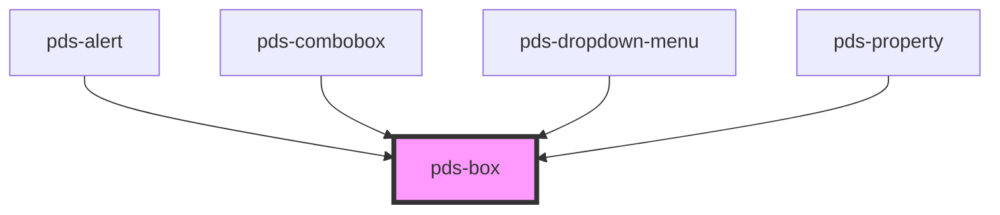

# pds-box

<!-- Auto Generated Below -->

## Properties

| Property             | Attribute              | Description                                                                                                                                                                                        | Type                                                                                         | Default     |
| -------------------- | ---------------------- | -------------------------------------------------------------------------------------------------------------------------------------------------------------------------------------------------- | -------------------------------------------------------------------------------------------- | ----------- |
| `alignItems`         | `align-items`          | Defines how items within the box are aligned.                                                                                                                                                      | `"baseline" \| "center" \| "end" \| "start" \| "stretch"`                                    | `undefined` |
| `alignSelf`          | `align-self`           | Defines how the box is aligned within its container.                                                                                                                                               | `"baseline" \| "center" \| "end" \| "start" \| "stretch"`                                    | `undefined` |
| `auto`               | `auto`                 | If `true`, the box will be sized to fit its contents.                                                                                                                                              | `boolean`                                                                                    | `undefined` |
| `backgroundColor`    | `background-color`     | Defines the background-color of the box.                                                                                                                                                           | `string`                                                                                     | `undefined` |
| `border`             | `border`               | If `true`, the box will have a border.                                                                                                                                                             | `boolean`                                                                                    | `false`     |
| `borderColor`        | `border-color`         | Defines the border color of the box.                                                                                                                                                               | `string`                                                                                     | `undefined` |
| `borderRadius`       | `border-radius`        | Defines how rounded the box corners are.                                                                                                                                                           | `"circle" \| "lg" \| "md" \| "none" \| "sm" \| "xs"`                                         | `undefined` |
| `direction`          | `direction`            | Defines the orientation of the box items.                                                                                                                                                          | `"column" \| "row"`                                                                          | `undefined` |
| `display`            | `display`              | Defines the display style of the box.                                                                                                                                                              | `"block" \| "flex" \| "inline-block" \| "inline-flex"`                                       | `undefined` |
| `fit`                | `fit`                  | If `true`, sets the box `max-width` to `100%`.                                                                                                                                                     | `boolean`                                                                                    | `undefined` |
| `flex`               | `flex`                 | Defines how a box will grow or shrink to fit the space available in its container. Can be a predefined value ('none', 'grow', 'shrink') or a custom flex value (e.g., '1', '0 1 auto').            | `string`                                                                                     | `undefined` |
| `gap`                | `gap`                  | Defines the spacing between the box items.                                                                                                                                                         | `"lg" \| "md" \| "none" \| "sm" \| "xl" \| "xs" \| "xxl" \| "xxs"`                           | `undefined` |
| `justifyContent`     | `justify-content`      | Defines the horizontal alignment of the box items.                                                                                                                                                 | `"center" \| "end" \| "space-around" \| "space-between" \| "start"`                          | `undefined` |
| `marginBlockEnd`     | `margin-block-end`     | Defines the box's outer bottom spacing.                                                                                                                                                            | `"lg" \| "md" \| "none" \| "sm" \| "xl" \| "xs" \| "xxl" \| "xxs"`                           | `undefined` |
| `marginBlockStart`   | `margin-block-start`   | Defines the box's outer top spacing.                                                                                                                                                               | `"lg" \| "md" \| "none" \| "sm" \| "xl" \| "xs" \| "xxl" \| "xxs"`                           | `undefined` |
| `marginInlineEnd`    | `margin-inline-end`    | Defines the box's outer right spacing.                                                                                                                                                             | `"lg" \| "md" \| "none" \| "sm" \| "xl" \| "xs" \| "xxl" \| "xxs"`                           | `undefined` |
| `marginInlineStart`  | `margin-inline-start`  | Defines the box's outer left spacing.                                                                                                                                                              | `"lg" \| "md" \| "none" \| "sm" \| "xl" \| "xs" \| "xxl" \| "xxs"`                           | `undefined` |
| `minHeight`          | `min-height`           | The minimum height of the row. Used in conjunction with alignment props                                                                                                                            | `string`                                                                                     | `undefined` |
| `minWidth`           | `min-width`            | The minimum width of the row. Used in conjunction with alignment props                                                                                                                             | `string`                                                                                     | `undefined` |
| `offset`             | `offset`               | Move columns to the end direction of the row for all screen sizes. Increases the starting margin of a column by specified number of columns.                                                       | `"0" \| "1" \| "10" \| "11" \| "12" \| "2" \| "3" \| "4" \| "5" \| "6" \| "7" \| "8" \| "9"` | `undefined` |
| `offsetLg`           | `offset-lg`            | Move columns to the end direction of the row for `LG` screen sizes. Increases the starting margin of a column by specified number of columns.                                                      | `"0" \| "1" \| "10" \| "11" \| "12" \| "2" \| "3" \| "4" \| "5" \| "6" \| "7" \| "8" \| "9"` | `undefined` |
| `offsetMd`           | `offset-md`            | Move columns to the end direction of the row for `MD` screen sizes. Increases the starting margin of a column by specified number of columns.                                                      | `"0" \| "1" \| "10" \| "11" \| "12" \| "2" \| "3" \| "4" \| "5" \| "6" \| "7" \| "8" \| "9"` | `undefined` |
| `offsetSm`           | `offset-sm`            | Move columns to the end direction of the row for `SM` screen sizes. Increases the starting margin of a column by specified number of columns.                                                      | `"0" \| "1" \| "10" \| "11" \| "12" \| "2" \| "3" \| "4" \| "5" \| "6" \| "7" \| "8" \| "9"` | `undefined` |
| `offsetXl`           | `offset-xl`            | Move columns to the end direction of the row for `XL` screen sizes. Increases the starting margin of a column by specified number of columns.                                                      | `"0" \| "1" \| "10" \| "11" \| "12" \| "2" \| "3" \| "4" \| "5" \| "6" \| "7" \| "8" \| "9"` | `undefined` |
| `offsetXs`           | `offset-xs`            | Move columns to the end direction of the row for `XS` screen sizes. Increases the starting margin of a column by specified number of columns.                                                      | `"0" \| "1" \| "10" \| "11" \| "12" \| "2" \| "3" \| "4" \| "5" \| "6" \| "7" \| "8" \| "9"` | `undefined` |
| `padding`            | `padding`              | Defines the spacing between the box items.                                                                                                                                                         | `"lg" \| "md" \| "none" \| "sm" \| "xl" \| "xs" \| "xxl" \| "xxs"`                           | `undefined` |
| `paddingBlockEnd`    | `padding-block-end`    | Defines the bottom spacing.                                                                                                                                                                        | `"lg" \| "md" \| "none" \| "sm" \| "xl" \| "xs" \| "xxl" \| "xxs"`                           | `undefined` |
| `paddingBlockStart`  | `padding-block-start`  | Defines the top spacing.                                                                                                                                                                           | `"lg" \| "md" \| "none" \| "sm" \| "xl" \| "xs" \| "xxl" \| "xxs"`                           | `undefined` |
| `paddingInlineEnd`   | `padding-inline-end`   | Defines the right spacing.                                                                                                                                                                         | `"lg" \| "md" \| "none" \| "sm" \| "xl" \| "xs" \| "xxl" \| "xxs"`                           | `undefined` |
| `paddingInlineStart` | `padding-inline-start` | Defines the left spacing.                                                                                                                                                                          | `"lg" \| "md" \| "none" \| "sm" \| "xl" \| "xs" \| "xxl" \| "xxs"`                           | `undefined` |
| `shadow`             | `shadow`               | Defines the box shadow.                                                                                                                                                                            | `"050" \| "100" \| "150" \| "200" \| "300" \| "400" \| "500" \| "none"`                      | `undefined` |
| `size`               | `size`                 | Sets the default column width for the component. This value applies from the smallest screen size (XS) upwards, unless overridden by a breakpoint-specific size prop at that breakpoint or larger. | `"0" \| "1" \| "10" \| "11" \| "12" \| "2" \| "3" \| "4" \| "5" \| "6" \| "7" \| "8" \| "9"` | `undefined` |
| `sizeLg`             | `size-lg`              | At screen sizes from the LG breakpoint and larger (992px and up), this will take the specified number of columns. This overrides any value set by size, sizeXs, and up.                            | `"0" \| "1" \| "10" \| "11" \| "12" \| "2" \| "3" \| "4" \| "5" \| "6" \| "7" \| "8" \| "9"` | `undefined` |
| `sizeMd`             | `size-md`              | At screen sizes from the MD breakpoint and larger (768px and up), this will take the specified number of columns. This overrides any value set by size, sizeXs, and up.                            | `"0" \| "1" \| "10" \| "11" \| "12" \| "2" \| "3" \| "4" \| "5" \| "6" \| "7" \| "8" \| "9"` | `undefined` |
| `sizeSm`             | `size-sm`              | At screen sizes from the SM breakpoint and larger (576px and up), this will take the specified number of columns. This overrides any value set by size or sizeXs.                                  | `"0" \| "1" \| "10" \| "11" \| "12" \| "2" \| "3" \| "4" \| "5" \| "6" \| "7" \| "8" \| "9"` | `undefined` |
| `sizeXl`             | `size-xl`              | At screen sizes from the XL breakpoint and larger (1200px and up), this will take the specified number of columns. This overrides any value set by size, sizeXs, and up.                           | `"0" \| "1" \| "10" \| "11" \| "12" \| "2" \| "3" \| "4" \| "5" \| "6" \| "7" \| "8" \| "9"` | `undefined` |
| `sizeXs`             | `size-xs`              | At the XS breakpoint, this prop will take the number of columns specified. This overrides the base size prop for this specific range.                                                              | `"0" \| "1" \| "10" \| "11" \| "12" \| "2" \| "3" \| "4" \| "5" \| "6" \| "7" \| "8" \| "9"` | `undefined` |
| `wrap`               | `wrap`                 | Defines whether flex items are forced onto one line or can wrap onto multiple lines.                                                                                                               | `"nowrap" \| "wrap"`                                                                         | `undefined` |

## Dependencies

### Used by

 - [pds-alert](../pds-alert)
 - [pds-combobox](../pds-combobox)
 - [pds-dropdown-menu](../pds-dropdown-menu)
 - [pds-property](../pds-property)

### Graph

----------------------------------------------

