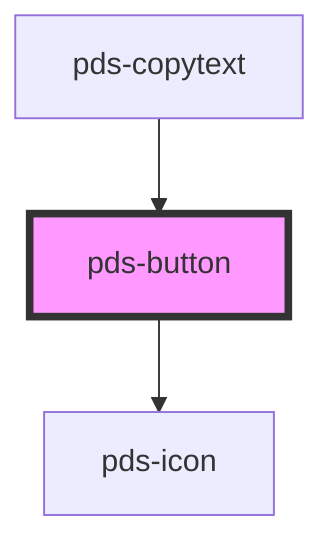

# pds-button

<!-- Auto Generated Below -->

## Properties

| Property      | Attribute      | Description                                                           | Type                                                                                  | Default     |
| ------------- | -------------- | --------------------------------------------------------------------- | ------------------------------------------------------------------------------------- | ----------- |
| `componentId` | `component-id` | A unique identifier used for the underlying component `id` attribute. | `string`                                                                              | `undefined` |
| `disabled`    | `disabled`     | Toggles disabled state of button                                      | `boolean`                                                                             | `false`     |
| `icon`        | `icon`         | Displays icon before text when icon string matches an icon name       | `string`                                                                              | `null`      |
| `name`        | `name`         | Provides button with a submittable name                               | `string`                                                                              | `undefined` |
| `type`        | `type`         | Provides button with a type                                           | `"button" \| "reset" \| "submit"`                                                     | `'button'`  |
| `value`       | `value`        | Provides button with a submittable value                              | `string`                                                                              | `undefined` |
| `variant`     | `variant`      | Sets button variant styles as outlined in Figma documentation         | `"accent" \| "destructive" \| "disclosure" \| "primary" \| "secondary" \| "unstyled"` | `'primary'` |

## Events

| Event      | Description | Type               |
| ---------- | ----------- | ------------------ |
| `pdsClick` |             | `CustomEvent<any>` |

## Shadow Parts

| Part       | Description                                                                  |
| ---------- | ---------------------------------------------------------------------------- |
| `"button"` | The main button element that represents the button component.                |
| `"caret"`  | The caret icon element that appears when the button variant is 'disclosure'. |
| `"icon"`   | The icon element that appears before the text in the button, if provided.    |

## Dependencies

### Used by

 - [pds-copytext](../pds-copytext)

### Depends on

- pds-icon

### Graph

----------------------------------------------

