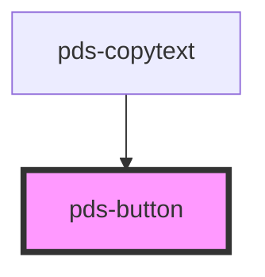

# pds-button

<!-- Auto Generated Below -->

## Properties

| Property   | Attribute  | Description                                                     | Type                                                                                  | Default     |
| ---------- | ---------- | --------------------------------------------------------------- | ------------------------------------------------------------------------------------- | ----------- |
| `disabled` | `disabled` | Toggles disabled state of button                                | `boolean`                                                                             | `false`     |
| `icon`     | `icon`     | Displays icon before text when icon string matches an icon name | `string`                                                                              | `null`      |
| `name`     | `name`     | Provides button with a submittable name                         | `string`                                                                              | `undefined` |
| `type`     | `type`     | Provides button with a type                                     | `"button" \| "reset" \| "submit"`                                                     | `'button'`  |
| `value`    | `value`    | Provides button with a submittable value                        | `string`                                                                              | `undefined` |
| `variant`  | `variant`  | Sets button variant styles as outlined in Figma documentation   | `"accent" \| "destructive" \| "disclosure" \| "primary" \| "secondary" \| "unstyled"` | `'primary'` |

## Dependencies

### Used by

 - [pds-copytext](../pds-copytext)

### Graph

----------------------------------------------

