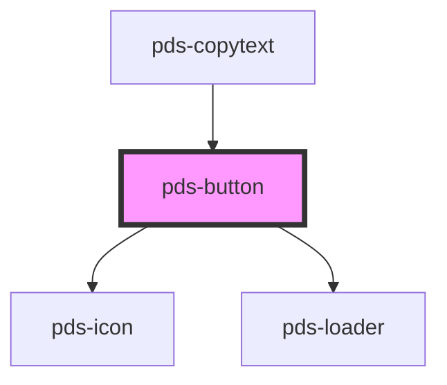

# pds-button

<!-- Auto Generated Below -->

## Properties

| Property      | Attribute      | Description                                                                                                                                                               | Type                                                                                  | Default     |
| ------------- | -------------- | ------------------------------------------------------------------------------------------------------------------------------------------------------------------------- | ------------------------------------------------------------------------------------- | ----------- |
| `componentId` | `component-id` | A unique identifier used for the underlying component `id` attribute.                                                                                                     | `string`                                                                              | `undefined` |
| `disabled`    | `disabled`     | Determines the button's disabled state.                                                                                                                                   | `boolean`                                                                             | `false`     |
| `fullWidth`   | `full-width`   | Determines if the button should take up the full width of its container.                                                                                                  | `boolean`                                                                             | `false`     |
| `href`        | `href`         | If provided, renders the component as an anchor (`<a>`) element instead of a button. When using href, button-specific props (type, name, value, loading) will be ignored. | `string`                                                                              | `undefined` |
| `icon`        | `icon`         | **[DEPRECATED]** Use `start` slot instead.  Displays a leading icon in the button. DEPRECATED.                                     | `string`                                                                              | `null`      |
| `iconOnly`    | `icon-only`    | When true, displays only the icon and visually hides the text (keeping it accessible).                                                                                    | `boolean`                                                                             | `false`     |
| `loading`     | `loading`      | Determines if the button is in a loading state. When true, displays a loader and hides the button text.                                                                   | `boolean`                                                                             | `false`     |
| `name`        | `name`         | Provides the button with a submittable name.                                                                                                                              | `string`                                                                              | `undefined` |
| `target`      | `target`       | Specifies where to open the linked document when href is provided. Only applies when href is set.                                                                         | `"_blank" \| "_parent" \| "_self" \| "_top"`                                          | `undefined` |
| `type`        | `type`         | Provides button with a type.                                                                                                                                              | `"button" \| "reset" \| "submit"`                                                     | `'button'`  |
| `value`       | `value`        | Provides button with a submittable value                                                                                                                                  | `string`                                                                              | `undefined` |
| `variant`     | `variant`      | Sets the style variant of the button.                                                                                                                                     | `"accent" \| "destructive" \| "disclosure" \| "primary" \| "secondary" \| "unstyled"` | `'primary'` |

## Events

| Event      | Description | Type               |
| ---------- | ----------- | ------------------ |
| `pdsClick` |             | `CustomEvent<any>` |

## Slots

| Slot          | Description                                |
| ------------- | ------------------------------------------ |
| `"(default)"` | Button text.                               |
| `"end"`       | Content to display after the button text.  |
| `"start"`     | Content to display before the button text. |

## Shadow Parts

| Part               | Description                                                                           |
| ------------------ | ------------------------------------------------------------------------------------- |
| `"button"`         | Exposes the button element for styling.                                               |
| `"button-content"` | Exposes the button content for styling.                                               |
| `"button-text"`    | Exposes the button text for styling.                                                  |
| `"caret"`          | Exposes the caret icon component for styling. Appears only on the disclosure variant. |
| `"icon"`           | Exposes the icon component for styling.                                               |

## Dependencies

### Used by

 - [pds-copytext](../pds-copytext)

### Depends on

- pds-icon
- [pds-loader](../pds-loader)

### Graph

----------------------------------------------

