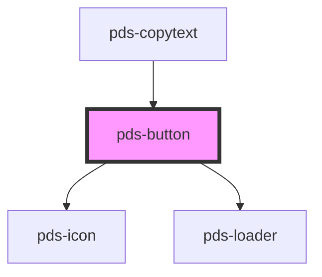

# pds-button

<!-- Auto Generated Below -->

## Properties

| Property      | Attribute      | Description                                                                                             | Type                                                                                  | Default     |
| ------------- | -------------- | ------------------------------------------------------------------------------------------------------- | ------------------------------------------------------------------------------------- | ----------- |
| `componentId` | `component-id` | A unique identifier used for the underlying component `id` attribute.                                   | `string`                                                                              | `undefined` |
| `disabled`    | `disabled`     | Determines the button's disabled state.                                                                 | `boolean`                                                                             | `false`     |
| `fullWidth`   | `full-width`   | Determines if the button should take up the full width of its container.                                | `boolean`                                                                             | `false`     |
| `icon`        | `icon`         | Displays an icon before the text when the icon string matches an icon name.                             | `string`                                                                              | `null`      |
| `loading`     | `loading`      | Determines if the button is in a loading state. When true, displays a loader and hides the button text. | `boolean`                                                                             | `false`     |
| `name`        | `name`         | Provides the button with a submittable name.                                                            | `string`                                                                              | `undefined` |
| `type`        | `type`         | Provides button with a type.                                                                            | `"button" \| "reset" \| "submit"`                                                     | `'button'`  |
| `value`       | `value`        | Provides button with a submittable value                                                                | `string`                                                                              | `undefined` |
| `variant`     | `variant`      | Sets the style variant of the button.                                                                   | `"accent" \| "destructive" \| "disclosure" \| "primary" \| "secondary" \| "unstyled"` | `'primary'` |

## Events

| Event      | Description | Type               |
| ---------- | ----------- | ------------------ |
| `pdsClick` |             | `CustomEvent<any>` |

## Shadow Parts

| Part       | Description                                                                           |
| ---------- | ------------------------------------------------------------------------------------- |
| `"button"` | Exposes the button element for styling.                                               |
| `"caret"`  | Exposes the caret icon component for styling. Appears only on the disclosure variant. |
| `"icon"`   | Exposes the icon component for styling.                                               |
| `"loader"` |                                                                                       |

## Dependencies

### Used by

 - [pds-copytext](../pds-copytext)

### Depends on

- pds-icon
- [pds-loader](../pds-loader)

### Graph

----------------------------------------------

