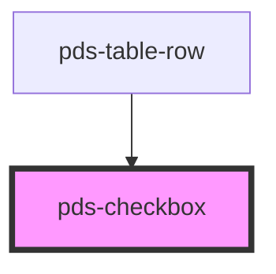

# pds-checkbox

<!-- Auto Generated Below -->

## Properties

| Property                   | Attribute        | Description                                                                                                                                                                                                                                               | Type      | Default     |
| -------------------------- | ---------------- | --------------------------------------------------------------------------------------------------------------------------------------------------------------------------------------------------------------------------------------------------------- | --------- | ----------- |
| `checked`                  | `checked`        | It determines whether or not the checkbox is checked.                                                                                                                                                                                                     | `boolean` | `undefined` |
| `componentId` _(required)_ | `component-id`   | A unique identifier used for the underlying component `id` attribute and the label `for` attribute.                                                                                                                                                       | `string`  | `undefined` |
| `disabled`                 | `disabled`       | It determines whether or not the checkbox is disabled.                                                                                                                                                                                                    | `boolean` | `undefined` |
| `errorMessage`             | `error-message`  | Displays message text describing an invalid state.                                                                                                                                                                                                        | `string`  | `undefined` |
| `helperMessage`            | `helper-message` | String used for helper message below checkbox.                                                                                                                                                                                                            | `string`  | `undefined` |
| `indeterminate`            | `indeterminate`  | If `true`, the checkbox will visually appear as indeterminate. Only JavaScript can set the objects `indeterminate` property. See [MDN Web Docs](https://developer.mozilla.org/en-US/docs/Web/HTML/Element/input/checkbox#indeterminate_state_checkboxes). | `boolean` | `undefined` |
| `invalid`                  | `invalid`        | It determines whether or not the checkbox is invalid.                                                                                                                                                                                                     | `boolean` | `undefined` |
| `label`                    | `label`          | String used for label text next to checkbox.                                                                                                                                                                                                              | `string`  | `undefined` |
| `labelHidden`              | `label-hidden`   | Visually hides the label text for instances where only the checkbox should be displayed. Label remains accessible to assistive technology such as screen readers.                                                                                         | `boolean` | `undefined` |
| `name`                     | `name`           | String used for checkbox `name` attribute.                                                                                                                                                                                                                | `string`  | `undefined` |
| `required`                 | `required`       | It determines whether or not the checkbox is required.                                                                                                                                                                                                    | `boolean` | `undefined` |
| `value`                    | `value`          | The value of the checkbox that is submitted with a form.                                                                                                                                                                                                  | `string`  | `undefined` |

## Events

| Event               | Description                                                                        | Type                                          |
| ------------------- | ---------------------------------------------------------------------------------- | --------------------------------------------- |
| `pdsCheckboxChange` | Emits a boolean indicating whether the checkbox is currently checked or unchecked. | `CustomEvent<CheckboxChangeEventDetail<any>>` |

## Dependencies

### Used by

 - [pds-table-row](../pds-table/pds-table-row)

### Graph

----------------------------------------------

