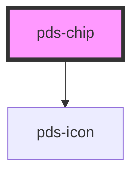

# pds-chip

<!-- Auto Generated Below -->

## Properties

| Property      | Attribute      | Description                                                       | Type                                                                    | Default     |
| ------------- | -------------- | ----------------------------------------------------------------- | ----------------------------------------------------------------------- | ----------- |
| `componentId` | `component-id` | A unique identifier for the component's `id` attribute.           | `string`                                                                | `undefined` |
| `dot`         | `dot`          | Specifies whether a dot should be displayed on the chip.          | `boolean`                                                               | `false`     |
| `label`       | `label`        | Sets the text label content of the chip.                          | `string`                                                                | `undefined` |
| `large`       | `large`        | Determines whether the chip should be displayed in a larger size. | `boolean`                                                               | `false`     |
| `sentiment`   | `sentiment`    | Defines the color scheme of the chip.                             | `"accent" \| "danger" \| "info" \| "neutral" \| "success" \| "warning"` | `'neutral'` |
| `variant`     | `variant`      | Sets the style variant of the chip.                               | `"dropdown" \| "tag" \| "text"`                                         | `'text'`    |

## Events

| Event              | Description                                                           | Type               |
| ------------------ | --------------------------------------------------------------------- | ------------------ |
| `pdsTagCloseClick` | Event emitted when the close button is clicked on a tag variant chip. | `CustomEvent<any>` |

## Dependencies

### Depends on

- pds-icon

### Graph

----------------------------------------------

