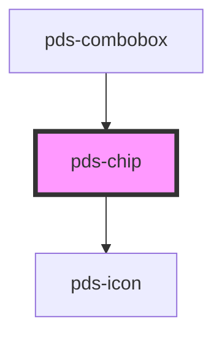

# pds-chip

<!-- Auto Generated Below -->

## Properties

| Property      | Attribute      | Description                                                                                                     | Type                                                                               | Default     |
| ------------- | -------------- | --------------------------------------------------------------------------------------------------------------- | ---------------------------------------------------------------------------------- | ----------- |
| `componentId` | `component-id` | A unique identifier used for the underlying component `id` attribute.                                           | `string`                                                                           | `undefined` |
| `dot`         | `dot`          | Determines whether a dot should be displayed on the chip. Note: This prop is ignored when sentiment is 'brand'. | `boolean`                                                                          | `false`     |
| `icon`        | `icon`         | The name of the icon to display before the chip text.                                                           | `string`                                                                           | `undefined` |
| `large`       | `large`        | Determines whether the chip should be displayed in a larger size.                                               | `boolean`                                                                          | `false`     |
| `sentiment`   | `sentiment`    | Defines the color scheme of the chip.                                                                           | `"accent" \| "brand" \| "danger" \| "info" \| "neutral" \| "success" \| "warning"` | `'neutral'` |
| `variant`     | `variant`      | Sets the style variant of the chip. Note: This prop is ignored when sentiment is 'brand'.                       | `"dropdown" \| "tag" \| "text"`                                                    | `'text'`    |

## Events

| Event              | Description                                                           | Type               |
| ------------------ | --------------------------------------------------------------------- | ------------------ |
| `pdsTagCloseClick` | Event emitted when the close button is clicked on a tag variant chip. | `CustomEvent<any>` |

## Slots

| Slot          | Description            |
| ------------- | ---------------------- |
| `"(default)"` | The chip's label text. |

## Dependencies

### Used by

 - [pds-combobox](../pds-combobox)

### Depends on

- pds-icon

### Graph

----------------------------------------------

