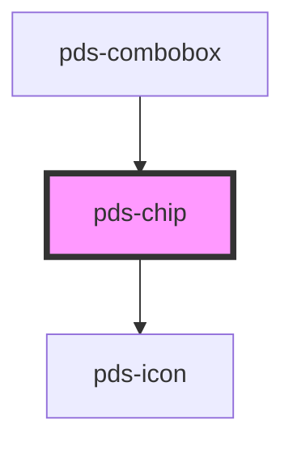

# pds-chip

<!-- Auto Generated Below -->

## Properties

| Property           | Attribute            | Description                                                                                                                                                                                            | Type                                                                               | Default     |
| ------------------ | -------------------- | ------------------------------------------------------------------------------------------------------------------------------------------------------------------------------------------------------ | ---------------------------------------------------------------------------------- | ----------- |
| `componentId`      | `component-id`       | A unique identifier used for the underlying component `id` attribute.                                                                                                                                  | `string`                                                                           | `undefined` |
| `dot`              | `dot`                | Determines whether a dot should be displayed on the chip. Note: This prop is ignored when sentiment is 'brand'.                                                                                        | `boolean`                                                                          | `false`     |
| `icon`             | `icon`               | The name of the icon to display before the chip text.                                                                                                                                                  | `string`                                                                           | `undefined` |
| `large`            | `large`              | **[DEPRECATED]** Use `size` prop instead. Set `size="lg"` for the large variant.  Determines whether the chip should be displayed in a larger size. DEPRECATED. | `boolean`                                                                          | `false`     |
| `removeHttpMethod` | `remove-http-method` | HTTP method to use for the remove action. Adds data-method and data-turbo-method attributes for Rails/Turbo compatibility. Only applies when removeUrl is provided.                                    | `"delete" \| "get" \| "patch" \| "post" \| "put"`                                  | `undefined` |
| `removeTarget`     | `remove-target`      | Specifies where to open the linked document when removeUrl is provided. Only applies when removeUrl is set.                                                                                            | `"_blank" \| "_parent" \| "_self" \| "_top"`                                       | `undefined` |
| `removeUrl`        | `remove-url`         | URL to navigate to when the remove button is clicked. When provided, renders the close button as a link instead of a button. Only applies to tag variant.                                              | `string`                                                                           | `undefined` |
| `sentiment`        | `sentiment`          | Defines the color scheme of the chip.                                                                                                                                                                  | `"accent" \| "brand" \| "danger" \| "info" \| "neutral" \| "success" \| "warning"` | `'neutral'` |
| `size`             | `size`               | Sets the size of the chip.                                                                                                                                                                             | `"lg" \| "md" \| "sm"`                                                             | `undefined` |
| `variant`          | `variant`            | Sets the style variant of the chip. Note: This prop is ignored when sentiment is 'brand'.                                                                                                              | `"dropdown" \| "tag" \| "text"`                                                    | `'text'`    |

## Events

| Event              | Description                                                           | Type                |
| ------------------ | --------------------------------------------------------------------- | ------------------- |
| `pdsTagCloseClick` | Event emitted when the close button is clicked on a tag variant chip. | `CustomEvent<void>` |

## Slots

| Slot          | Description            |
| ------------- | ---------------------- |
| `"(default)"` | The chip's label text. |

## Dependencies

### Used by

 - [pds-combobox](../pds-combobox)

### Depends on

- pds-icon

### Graph

----------------------------------------------

