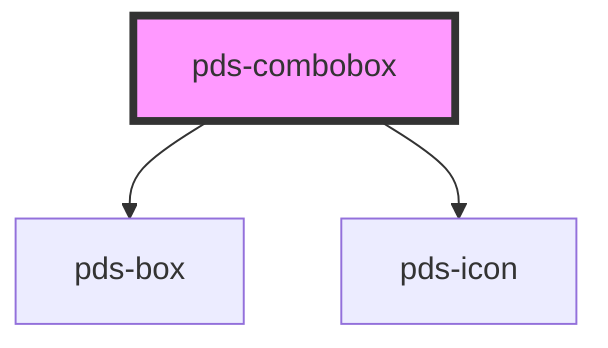

# pds-combobox


<!-- Auto Generated Below -->


## Overview

PdsCombobox - An advanced searchable dropdown component with filtering and accessibility

**⚠️ CRITICAL BEHAVIOR:**
- **Search & Filter**: Real-time filtering of options as user types
- **Multiple Modes**: Filter mode (search) or select-only mode (dropdown)
- **Two Triggers**: Input trigger (editable) or button trigger (non-editable)
- **Accessibility**: Full ARIA support with proper labeling and keyboard navigation
- **Custom Layouts**: Support for rich option content with HTML layouts

**⚠️ VISUAL PATTERN CLARIFICATION:**

When analyzing screenshots or visual layouts:
- **Text above combobox**: This is the combobox's LABEL, not a separate `pds-text` component
- **Label Integration**: The `label` prop creates text that appears above the combobox field
- **No Separate Text Needed**: Do not add `pds-text` components for combobox labels
- **Visual Hierarchy**: Label text is styled and positioned automatically by the combobox component

**Common Mistake**: Seeing text above a combobox and assuming it's a separate `pds-text` component
**Correct Understanding**: The text is the combobox's integrated label created by the `label` prop

**Usage Examples:**
```tsx
// Basic combobox with input trigger
<pds-combobox label="Search Users" component-id="users" placeholder="Type to search...">
  <option value="user1">John Doe</option>
  <option value="user2">Jane Smith</option>
  <option value="user3">Bob Johnson</option>
</pds-combobox>

// Combobox with button trigger
<pds-combobox
  label="Select Category"
  component-id="category"
  trigger="button"
  placeholder="Choose a category"
>
  <option value="tech">Technology</option>
  <option value="design">Design</option>
  <option value="marketing">Marketing</option>
</pds-combobox>

// Select-only mode (no filtering)
<pds-combobox
  label="Country"
  component-id="country"
  mode="select-only"
  trigger="button"
>
  <option value="us">United States</option>
  <option value="ca">Canada</option>
</pds-combobox>

// ❌ INCORRECT - Don't add separate text for labels
<pds-text>Search Users</pds-text>
<pds-combobox component-id="users">
  <option value="user1">John Doe</option>
</pds-combobox>

// ✅ CORRECT - Use the label prop
<pds-combobox label="Search Users" component-id="users">
  <option value="user1">John Doe</option>
</pds-combobox>
```

## Properties

| Property                   | Attribute                | Description                                                                                                                                                                                                                                                                                                                                                                                                                                                                                                                                                                                                                                                                                                                                                                                                                                                                                                       | Type                                                         | Default          |
| -------------------------- | ------------------------ | ----------------------------------------------------------------------------------------------------------------------------------------------------------------------------------------------------------------------------------------------------------------------------------------------------------------------------------------------------------------------------------------------------------------------------------------------------------------------------------------------------------------------------------------------------------------------------------------------------------------------------------------------------------------------------------------------------------------------------------------------------------------------------------------------------------------------------------------------------------------------------------------------------------------- | ------------------------------------------------------------ | ---------------- |
| `componentId` _(required)_ | `component-id`           | A unique identifier used for the underlying component `id` attribute.                                                                                                                                                                                                                                                                                                                                                                                                                                                                                                                                                                                                                                                                                                                                                                                                                                             | `string`                                                     | `undefined`      |
| `customOptionLayouts`      | `custom-option-layouts`  | Enable custom layout content for options. Options with data-layout attribute will render their HTML content. ⚠️ Security Warning: Only use with trusted content. Basic XSS protection is applied, but avoid user-generated content.                                                                                                                                                                                                                                                                                                                                                                                                                                                                                                                                                                                                                                                                               | `boolean`                                                    | `false`          |
| `customTriggerContent`     | `custom-trigger-content` | Enable custom layout content for the button trigger via the trigger-content slot. When true, uses slot content for initial state but updates dynamically with selected option layout. ⚠️ Security Warning: Only use with trusted content. Basic XSS protection is applied, but avoid user-generated content.                                                                                                                                                                                                                                                                                                                                                                                                                                                                                                                                                                                                      | `boolean`                                                    | `false`          |
| `disabled`                 | `disabled`               | If true, the combobox is disabled.                                                                                                                                                                                                                                                                                                                                                                                                                                                                                                                                                                                                                                                                                                                                                                                                                                                                                | `boolean`                                                    | `false`          |
| `dropdownPlacement`        | `dropdown-placement`     | Placement of the dropdown relative to the trigger.                                                                                                                                                                                                                                                                                                                                                                                                                                                                                                                                                                                                                                                                                                                                                                                                                                                                | `"bottom-end" \| "bottom-start" \| "top-end" \| "top-start"` | `'bottom-start'` |
| `dropdownWidth`            | `dropdown-width`         | Width of the dropdown. Any valid CSS width value.                                                                                                                                                                                                                                                                                                                                                                                                                                                                                                                                                                                                                                                                                                                                                                                                                                                                 | `string`                                                     | `'236px'`        |
| `hideLabel`                | `hide-label`             | Visually hides the label text for instances where only the combobox should be displayed. Label remains accessible to assistive technology such as screen readers.                                                                                                                                                                                                                                                                                                                                                                                                                                                                                                                                                                                                                                                                                                                                                 | `boolean`                                                    | `false`          |
| `label`                    | `label`                  | Text to be displayed as the combobox label.  **⚠️ CRITICAL VISUAL BEHAVIOR:** - **Integrated Label**: Creates text that appears ABOVE the combobox field - **Not Separate Component**: This is NOT a separate `pds-text` component - **Automatic Styling**: Label is styled and positioned by the combobox component - **Visual Hierarchy**: Creates proper visual relationship between label and combobox  **Accessibility Impact:** - Creates proper label-combobox association - Required for screen reader accessibility - Sets `for` attribute to link with combobox - Can be visually hidden with `hideLabel` prop while remaining accessible  **⚠️ COMMON MISTAKE**: When analyzing screenshots, text above a combobox is the LABEL, not a separate text component  **Best Practice**: Always provide descriptive labels for combobox fields  **Example**: `label="Search Users"` for user search combobox | `string`                                                     | `undefined`      |
| `maxHeight`                | `max-height`             | Maximum height of the dropdown. Can be any valid CSS height value (e.g., '200px', '10rem'). When content exceeds this height, the dropdown will scroll.                                                                                                                                                                                                                                                                                                                                                                                                                                                                                                                                                                                                                                                                                                                                                           | `string`                                                     | `undefined`      |
| `mode`                     | `mode`                   | Determines the combobox mode: 'filter' (filter options as you type) or 'select-only' (show all options).                                                                                                                                                                                                                                                                                                                                                                                                                                                                                                                                                                                                                                                                                                                                                                                                          | `"filter" \| "select-only"`                                  | `'filter'`       |
| `placeholder`              | `placeholder`            | Placeholder text for the input field.                                                                                                                                                                                                                                                                                                                                                                                                                                                                                                                                                                                                                                                                                                                                                                                                                                                                             | `string`                                                     | `undefined`      |
| `trigger`                  | `trigger`                | Determines the combobox trigger: 'input' (editable input) or 'button' (button-like, non-editable).                                                                                                                                                                                                                                                                                                                                                                                                                                                                                                                                                                                                                                                                                                                                                                                                                | `"button" \| "input"`                                        | `'input'`        |
| `triggerVariant`           | `trigger-variant`        | The visual variant for the button trigger. Matches Pine button variants.                                                                                                                                                                                                                                                                                                                                                                                                                                                                                                                                                                                                                                                                                                                                                                                                                                          | `"accent" \| "destructive" \| "primary" \| "secondary"`      | `'secondary'`    |
| `triggerWidth`             | `trigger-width`          | Width of the trigger (button or input). Any valid CSS width value.                                                                                                                                                                                                                                                                                                                                                                                                                                                                                                                                                                                                                                                                                                                                                                                                                                                | `string`                                                     | `'fit-content'`  |
| `value`                    | `value`                  | The value of the combobox input.                                                                                                                                                                                                                                                                                                                                                                                                                                                                                                                                                                                                                                                                                                                                                                                                                                                                                  | `string`                                                     | `''`             |


## Events

| Event               | Description                     | Type                              |
| ------------------- | ------------------------------- | --------------------------------- |
| `pdsComboboxChange` | Emitted when the value changes. | `CustomEvent<{ value: string; }>` |


## Methods

### `getSelectedValue() => Promise<string | null>`

Gets the value of the currently selected option.

#### Returns

Type: `Promise<string>`


### `setFocus() => Promise<void>`

Sets focus on the native input element.

#### Returns

Type: `Promise<void>`


## Slots

| Slot                | Description                                                             |
| ------------------- | ----------------------------------------------------------------------- |
| `"option"`          | Option elements for the combobox dropdown                               |
| `"trigger-content"` | Custom content for the button trigger when customTriggerContent is true |


## Shadow Parts

| Part               | Description |
| ------------------ | ----------- |
| `"button-trigger"` |             |
| `"input"`          |             |


## Dependencies

### Depends on

- [pds-box](../pds-box)
- pds-icon

### Graph


----------------------------------------------


