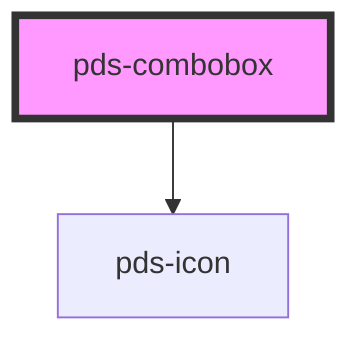

# pds-combobox

<!-- Auto Generated Below -->

## Properties

| Property                   | Attribute         | Description                                                                                              | Type                                   | Default       |
| -------------------------- | ----------------- | -------------------------------------------------------------------------------------------------------- | -------------------------------------- | ------------- |
| `componentId` _(required)_ | `component-id`    | A unique identifier used for the underlying component `id` attribute.                                    | `string`                               | `undefined`   |
| `disabled`                 | `disabled`        | If true, the combobox is disabled.                                                                       | `boolean`                              | `false`       |
| `label`                    | `label`           | Text to be displayed as the combobox label.                                                              | `string`                               | `undefined`   |
| `mode`                     | `mode`            | Determines the combobox mode: 'filter' (filter options as you type) or 'select-only' (show all options). | `"filter" \| "select-only"`            | `'filter'`    |
| `placeholder`              | `placeholder`     | Placeholder text for the input field.                                                                    | `string`                               | `undefined`   |
| `trigger`                  | `trigger`         | Determines the combobox trigger: 'input' (editable input) or 'button' (button-like, non-editable).       | `"button" \| "input"`                  | `'input'`     |
| `triggerVariant`           | `trigger-variant` | The visual variant for the button trigger. Matches Pine button variants.                                 | `"accent" \| "primary" \| "secondary"` | `'secondary'` |
| `value`                    | `value`           | The value of the combobox input.                                                                         | `string`                               | `''`          |

## Events

| Event               | Description                     | Type                              |
| ------------------- | ------------------------------- | --------------------------------- |
| `pdsComboboxChange` | Emitted when the value changes. | `CustomEvent<{ value: string; }>` |

## Methods

### `setFocus() => Promise<void>`

Sets focus on the native input element.

#### Returns

Type: `Promise<void>`

## Slots

| Slot       | Description                               |
| ---------- | ----------------------------------------- |
| `"option"` | Option elements for the combobox dropdown |

## Dependencies

### Depends on

- pds-icon

### Graph

----------------------------------------------

