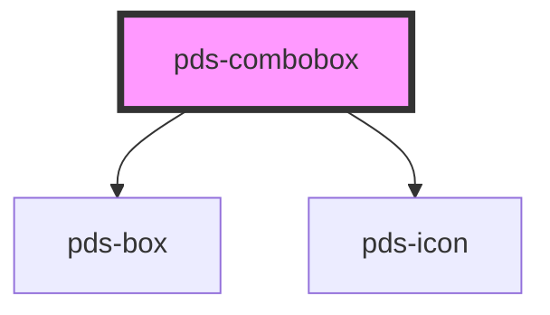

# pds-combobox

<!-- Auto Generated Below -->

## Properties

| Property                   | Attribute                | Description                                                                                                                                                                           | Type                                                         | Default          |
| -------------------------- | ------------------------ | ------------------------------------------------------------------------------------------------------------------------------------------------------------------------------------- | ------------------------------------------------------------ | ---------------- |
| `componentId` _(required)_ | `component-id`           | A unique identifier used for the underlying component `id` attribute.                                                                                                                 | `string`                                                     | `undefined`      |
| `customOptionLayouts`      | `custom-option-layouts`  | Enable custom layout content for options. Options with data-layout attribute will render their HTML content.                                                                          | `boolean`                                                    | `false`          |
| `customTriggerContent`     | `custom-trigger-content` | Enable custom layout content for the button trigger via the trigger-content slot. When true, uses slot content for initial state but updates dynamically with selected option layout. | `boolean`                                                    | `false`          |
| `disabled`                 | `disabled`               | If true, the combobox is disabled.                                                                                                                                                    | `boolean`                                                    | `false`          |
| `dropdownPlacement`        | `dropdown-placement`     | Placement of the dropdown relative to the trigger.                                                                                                                                    | `"bottom-end" \| "bottom-start" \| "top-end" \| "top-start"` | `'bottom-start'` |
| `dropdownWidth`            | `dropdown-width`         | Width of the dropdown. Any valid CSS width value.                                                                                                                                     | `string`                                                     | `'236px'`        |
| `hideLabel`                | `hide-label`             | Visually hides the label text for instances where only the combobox should be displayed. Label remains accessible to assistive technology such as screen readers.                     | `boolean`                                                    | `false`          |
| `label`                    | `label`                  | Text to be displayed as the combobox label.                                                                                                                                           | `string`                                                     | `undefined`      |
| `maxHeight`                | `max-height`             | Maximum height of the dropdown. Can be any valid CSS height value (e.g., '200px', '10rem'). When content exceeds this height, the dropdown will scroll.                               | `string`                                                     | `undefined`      |
| `mode`                     | `mode`                   | Determines the combobox mode: 'filter' (filter options as you type) or 'select-only' (show all options).                                                                              | `"filter" \| "select-only"`                                  | `'filter'`       |
| `placeholder`              | `placeholder`            | Placeholder text for the input field.                                                                                                                                                 | `string`                                                     | `undefined`      |
| `trigger`                  | `trigger`                | Determines the combobox trigger: 'input' (editable input) or 'button' (button-like, non-editable).                                                                                    | `"button" \| "input"`                                        | `'input'`        |
| `triggerVariant`           | `trigger-variant`        | The visual variant for the button trigger. Matches Pine button variants.                                                                                                              | `"accent" \| "destructive" \| "primary" \| "secondary"`      | `'secondary'`    |
| `triggerWidth`             | `trigger-width`          | Width of the trigger (button or input). Any valid CSS width value.                                                                                                                    | `string`                                                     | `'fit-content'`  |
| `value`                    | `value`                  | The value of the combobox input.                                                                                                                                                      | `string`                                                     | `''`             |

## Events

| Event               | Description                     | Type                              |
| ------------------- | ------------------------------- | --------------------------------- |
| `pdsComboboxChange` | Emitted when the value changes. | `CustomEvent<{ value: string; }>` |

## Methods

### `getSelectedValue() => Promise<string | null>`

Gets the value of the currently selected option.

#### Returns

Type: `Promise<string>`

### `setFocus() => Promise<void>`

Sets focus on the native input element.

#### Returns

Type: `Promise<void>`

## Slots

| Slot                | Description                                                             |
| ------------------- | ----------------------------------------------------------------------- |
| `"option"`          | Option elements for the combobox dropdown                               |
| `"trigger-content"` | Custom content for the button trigger when customTriggerContent is true |

## Shadow Parts

| Part               | Description |
| ------------------ | ----------- |
| `"button-trigger"` |             |
| `"input"`          |             |

## Dependencies

### Depends on

- [pds-box](../pds-box)
- pds-icon

### Graph

----------------------------------------------

