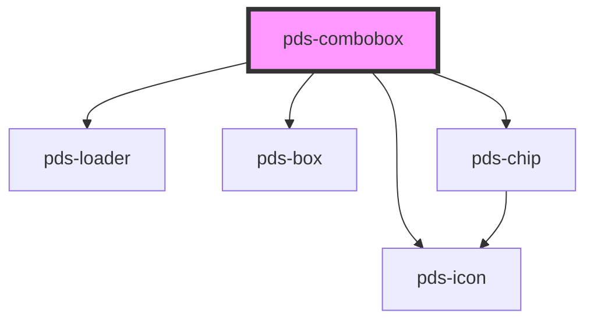

# pds-combobox

<!-- Auto Generated Below -->

## Properties

| Property                   | Attribute                | Description                                                                                                                                                                                                                                                                                                  | Type                                                                               | Default          |
| -------------------------- | ------------------------ | ------------------------------------------------------------------------------------------------------------------------------------------------------------------------------------------------------------------------------------------------------------------------------------------------------------ | ---------------------------------------------------------------------------------- | ---------------- |
| `asyncMethod`              | `async-method`           | HTTP method for async requests.                                                                                                                                                                                                                                                                              | `"GET" \| "POST"`                                                                  | `'GET'`          |
| `asyncUrl`                 | `async-url`              | URL endpoint for async data fetching.                                                                                                                                                                                                                                                                        | `string`                                                                           | `undefined`      |
| `chipDot`                  | `chip-dot`               | Whether a dot should be displayed on the chip trigger.                                                                                                                                                                                                                                                       | `boolean`                                                                          | `false`          |
| `chipIcon`                 | `chip-icon`              | The name of the icon to display in the chip trigger.                                                                                                                                                                                                                                                         | `string`                                                                           | `undefined`      |
| `chipLarge`                | `chip-large`             | Whether the chip trigger should be displayed in a larger size.                                                                                                                                                                                                                                               | `boolean`                                                                          | `false`          |
| `chipSentiment`            | `chip-sentiment`         | The sentiment for the chip trigger. Matches Pine chip sentiments.                                                                                                                                                                                                                                            | `"accent" \| "brand" \| "danger" \| "info" \| "neutral" \| "success" \| "warning"` | `'neutral'`      |
| `componentId` _(required)_ | `component-id`           | A unique identifier used for the underlying component `id` attribute.                                                                                                                                                                                                                                        | `string`                                                                           | `undefined`      |
| `customOptionLayouts`      | `custom-option-layouts`  | Enable custom layout content for options. Options with data-layout attribute will render their HTML content. ⚠️ Security Warning: Only use with trusted content. Basic XSS protection is applied, but avoid user-generated content.                                                                          | `boolean`                                                                          | `false`          |
| `customTriggerContent`     | `custom-trigger-content` | Enable custom layout content for the button trigger via the trigger-content slot. When true, uses slot content for initial state but updates dynamically with selected option layout. ⚠️ Security Warning: Only use with trusted content. Basic XSS protection is applied, but avoid user-generated content. | `boolean`                                                                          | `false`          |
| `debounce`                 | `debounce`               | Debounce delay in milliseconds for search/fetch.                                                                                                                                                                                                                                                             | `number`                                                                           | `300`            |
| `disabled`                 | `disabled`               | If true, the combobox is disabled.                                                                                                                                                                                                                                                                           | `boolean`                                                                          | `false`          |
| `dropdownPlacement`        | `dropdown-placement`     | Placement of the dropdown relative to the trigger.                                                                                                                                                                                                                                                           | `"bottom-end" \| "bottom-start" \| "top-end" \| "top-start"`                       | `'bottom-start'` |
| `dropdownWidth`            | `dropdown-width`         | Width of the dropdown. Any valid CSS width value.                                                                                                                                                                                                                                                            | `string`                                                                           | `'236px'`        |
| `formatResult`             | --                       | Function to format async results. Receives raw API response item.                                                                                                                                                                                                                                            | `(item: unknown) => ComboboxOption`                                                | `undefined`      |
| `hideLabel`                | `hide-label`             | Visually hides the label text for instances where only the combobox should be displayed. Label remains accessible to assistive technology such as screen readers.                                                                                                                                            | `boolean`                                                                          | `false`          |
| `label`                    | `label`                  | Text to be displayed as the combobox label.                                                                                                                                                                                                                                                                  | `string`                                                                           | `undefined`      |
| `loading`                  | `loading`                | Whether the component is currently loading async options.                                                                                                                                                                                                                                                    | `boolean`                                                                          | `false`          |
| `maxHeight`                | `max-height`             | Maximum height of the dropdown. Can be any valid CSS height value (e.g., '200px', '10rem'). When content exceeds this height, the dropdown will scroll.                                                                                                                                                      | `string`                                                                           | `undefined`      |
| `mode`                     | `mode`                   | Determines the combobox mode: 'filter' (filter options as you type) or 'select-only' (show all options).                                                                                                                                                                                                     | `"filter" \| "select-only"`                                                        | `'filter'`       |
| `name`                     | `name`                   | The name of the form control. Submitted with the form as part of a name/value pair.                                                                                                                                                                                                                          | `string`                                                                           | `undefined`      |
| `options`                  | --                       | Options provided externally (for consumer-managed async).                                                                                                                                                                                                                                                    | `ComboboxOption[]`                                                                 | `undefined`      |
| `placeholder`              | `placeholder`            | Placeholder text for the input field.                                                                                                                                                                                                                                                                        | `string`                                                                           | `undefined`      |
| `trigger`                  | `trigger`                | Determines the combobox trigger: 'input' (editable input), 'button' (button-like, non-editable), or 'chip' (chip-like, non-editable).                                                                                                                                                                        | `"button" \| "chip" \| "input"`                                                    | `'input'`        |
| `triggerVariant`           | `trigger-variant`        | The visual variant for the button trigger. Matches Pine button variants.                                                                                                                                                                                                                                     | `"accent" \| "destructive" \| "primary" \| "secondary"`                            | `'secondary'`    |
| `triggerWidth`             | `trigger-width`          | Width of the trigger (button or input). Any valid CSS width value.                                                                                                                                                                                                                                           | `string`                                                                           | `'fit-content'`  |
| `value`                    | `value`                  | The value of the combobox input.                                                                                                                                                                                                                                                                             | `string`                                                                           | `''`             |

## Events

| Event                    | Description                                           | Type                                          |
| ------------------------ | ----------------------------------------------------- | --------------------------------------------- |
| `pdsComboboxChange`      | Emitted when the value changes.                       | `CustomEvent<{ value: string; }>`             |
| `pdsComboboxLoadOptions` | Emitted to request more options (pagination).         | `CustomEvent<ComboboxLoadOptionsEventDetail>` |
| `pdsComboboxSearch`      | Emitted on search input (for consumer-managed async). | `CustomEvent<ComboboxSearchEventDetail>`      |

## Methods

### `getSelectedValue() => Promise<string | null>`

Gets the value of the currently selected option.

#### Returns

Type: `Promise<string>`

### `setFocus() => Promise<void>`

Sets focus on the native input element.

#### Returns

Type: `Promise<void>`

## Slots

| Slot                | Description                                                             |
| ------------------- | ----------------------------------------------------------------------- |
| `"empty"`           | Custom empty state message when no options match                        |
| `"loading"`         | Custom loading indicator                                                |
| `"option"`          | Option elements for the combobox dropdown                               |
| `"trigger-content"` | Custom content for the button trigger when customTriggerContent is true |

## Shadow Parts

| Part               | Description |
| ------------------ | ----------- |
| `"button-trigger"` |             |
| `"chip-trigger"`   |             |
| `"input"`          |             |

## Dependencies

### Depends on

- [pds-loader](../pds-loader)
- [pds-box](../pds-box)
- pds-icon
- [pds-chip](../pds-chip)

### Graph

----------------------------------------------

