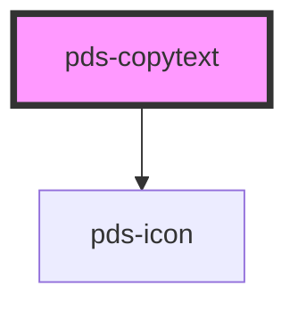

# pds-copytext

<!-- Auto Generated Below -->

## Properties

| Property    | Attribute    | Description                                                                             | Type      | Default     |
| ----------- | ------------ | --------------------------------------------------------------------------------------- | --------- | ----------- |
| `border`    | `border`     | Determines whether copytext should have a border.                                       | `boolean` | `true`      |
| `fullWidth` | `full-width` | Determines whether copytext should expand to the full width of its container.           | `boolean` | `false`     |
| `value`     | `value`      | The string that is displayed and that is also copied to the clipboard upon interaction. | `string`  | `undefined` |

## Dependencies

### Depends on

- pds-icon

### Graph

----------------------------------------------

