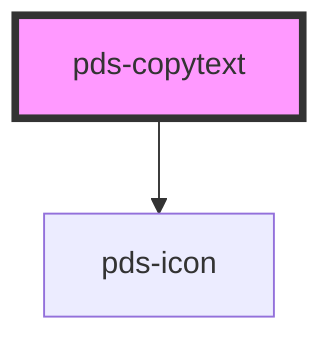

# pds-copytext

<!-- Auto Generated Below -->

## Properties

| Property    | Attribute    | Description | Type      | Default     |
| ----------- | ------------ | ----------- | --------- | ----------- |
| `border`    | `border`     |             | `boolean` | `true`      |
| `fullWidth` | `full-width` |             | `boolean` | `false`     |
| `value`     | `value`      |             | `string`  | `undefined` |

## Dependencies

### Depends on

- pds-icon

### Graph

----------------------------------------------

