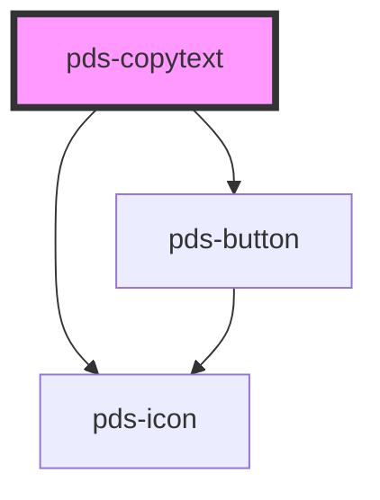

# pds-copytext

<!-- Auto Generated Below -->

## Properties

| Property             | Attribute      | Description                                                                     | Type      | Default     |
| -------------------- | -------------- | ------------------------------------------------------------------------------- | --------- | ----------- |
| `border`             | `border`       | Determines whether `copytext` should have a visible border.                     | `boolean` | `true`      |
| `componentId`        | `component-id` | A unique identifier used for the underlying component `id` attribute.           | `string`  | `undefined` |
| `fullWidth`          | `full-width`   | Determines whether `copytext` should expand to the full width of its container. | `boolean` | `false`     |
| `truncate`           | `truncate`     | Determines whether the `value` should truncate and display with an ellipsis.    | `boolean` | `false`     |
| `value` _(required)_ | `value`        | The string displayed that is also copied to the clipboard upon interaction.     | `string`  | `undefined` |

## Events

| Event              | Description                                  | Type               |
| ------------------ | -------------------------------------------- | ------------------ |
| `pdsCopyTextClick` | Event fired when copyText button is clicked. | `CustomEvent<any>` |

## Dependencies

### Depends on

- [pds-button](../pds-button)
- pds-icon

### Graph

----------------------------------------------

