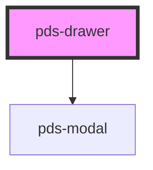

# pds-drawer

<!-- Auto Generated Below -->

## Overview

A resizable, non-modal side panel composed from `pds-modal`.

Unlike `pds-modal`, the page stays interactive while a drawer is open: no
dimming, no blur, no scroll lock, no click blocking. `pds-drawer` renders a
`pds-modal` internally with `disableTopLayer` always on and its backdrop
suppressed, and adds the edge, width and dismiss behavior a side panel
needs on top. It does not reimplement focus, Escape or dialog semantics —
those come from `pds-modal` unchanged.

## Properties

| Property       | Attribute       | Description                                                                                                                                                                                                                                                                                                                                                                                                                                   | Type               | Default     |
| -------------- | --------------- | --------------------------------------------------------------------------------------------------------------------------------------------------------------------------------------------------------------------------------------------------------------------------------------------------------------------------------------------------------------------------------------------------------------------------------------------- | ------------------ | ----------- |
| `componentId`  | `component-id`  | A unique identifier used for the underlying component `id` attribute.                                                                                                                                                                                                                                                                                                                                                                         | `string`           | `undefined` |
| `initialFocus` | `initial-focus` | Whether to move focus into the drawer when it opens. `auto` is right for a drawer opened by a direct user action (a click, a deep link the user just navigated to). Set to `none` for a drawer that can open from a background event while the user is mid-task elsewhere on the page — moving focus there would interrupt them, and the page stays live under a non-modal drawer, so it is a genuine data-entry risk, not just an annoyance. | `"auto" \| "none"` | `'auto'`    |
| `lightDismiss` | `light-dismiss` | Whether the drawer can be dismissed with a pointerdown outside it. Replaces `pds-modal`'s `backdropDismiss` — there is no backdrop to click. This also gates Escape, matching how `backdropDismiss` gates Escape on `pds-modal` today: setting this to `false` means the close button is the only way out.                                                                                                                                    | `boolean`          | `true`      |
| `open`         | `open`          | Whether the drawer is open                                                                                                                                                                                                                                                                                                                                                                                                                    | `boolean`          | `false`     |
| `scrollable`   | `scrollable`    | Whether the drawer content should be scrollable                                                                                                                                                                                                                                                                                                                                                                                               | `boolean`          | `true`      |
| `side`         | `side`          | Which edge of the viewport the drawer is docked to. Logical, so this is free under RTL — `end` is the inline-end edge regardless of direction.                                                                                                                                                                                                                                                                                                | `"end" \| "start"` | `'end'`     |
| `size`         | `size`          | The drawer's width. This is the only width control; use `pds-drawer`'s `resizable` mode (coming separately) to let the user adjust it.                                                                                                                                                                                                                                                                                                        | `"md" \| "sm"`     | `'md'`      |

## Events

| Event            | Description                       | Type                |
| ---------------- | --------------------------------- | ------------------- |
| `pdsDrawerClose` | Emitted when the drawer is closed | `CustomEvent<void>` |
| `pdsDrawerOpen`  | Emitted when the drawer is opened | `CustomEvent<void>` |

## Dependencies

### Depends on

- [pds-modal](../pds-modal)

### Graph

----------------------------------------------

