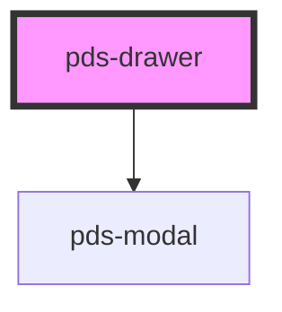

# pds-drawer

<!-- Auto Generated Below -->

## Overview

A non-modal side panel composed from `pds-modal`.

Unlike `pds-modal`, the page stays interactive while a drawer is open: no
dimming, no blur, no scroll lock, no click blocking. `pds-drawer` renders a
`pds-modal` internally with `disableTopLayer` always on and its backdrop
suppressed, and adds the edge, width, resize and dismiss behavior a side
panel needs on top. It does not reimplement focus, Escape or dialog
semantics — those come from `pds-modal` unchanged.

## Properties

| Property            | Attribute             | Description                                                                                                                                                                                                                                                                                                                                                                                                                                                                                                                                                                                       | Type               | Default           |
| ------------------- | --------------------- | ------------------------------------------------------------------------------------------------------------------------------------------------------------------------------------------------------------------------------------------------------------------------------------------------------------------------------------------------------------------------------------------------------------------------------------------------------------------------------------------------------------------------------------------------------------------------------------------------- | ------------------ | ----------------- |
| `componentId`       | `component-id`        | A unique identifier used for the underlying component `id` attribute.                                                                                                                                                                                                                                                                                                                                                                                                                                                                                                                             | `string`           | `undefined`       |
| `initialFocus`      | `initial-focus`       | Whether to move focus into the drawer when it opens. `auto` is right for a drawer opened by a direct user action (a click, a deep link the user just navigated to). Set to `none` for a drawer that can open from a background event while the user is mid-task elsewhere on the page — moving focus there would interrupt them, and the page stays live under a non-modal drawer, so it is a genuine data-entry risk, not just an annoyance.                                                                                                                                                     | `"auto" \| "none"` | `'auto'`          |
| `lightDismiss`      | `light-dismiss`       | Whether the drawer can be dismissed with a pointerdown outside it. Replaces `pds-modal`'s `backdropDismiss` — there is no backdrop to click. This also gates Escape, matching how `backdropDismiss` gates Escape on `pds-modal` today: setting this to `false` means the close button is the only way out.  A trigger outside the drawer should only ever set `open` to `true` and leave closing to the drawer itself. A toggle-style trigger (`open = !open`) fights light dismiss: clicking it while open closes the drawer on `pointerdown`, then the trigger's own click handler re-opens it. | `boolean`          | `true`            |
| `maxWidth`          | `max-width`           | The maximum width, in px, the panel can be dragged or keyed up to. Defaults from the `size` scale when unset. Only meaningful when `resizable` is true.                                                                                                                                                                                                                                                                                                                                                                                                                                           | `number`           | `undefined`       |
| `minWidth`          | `min-width`           | The minimum width, in px, the panel can be dragged or keyed down to. Defaults from the `size` scale when unset. Only meaningful when `resizable` is true.                                                                                                                                                                                                                                                                                                                                                                                                                                         | `number`           | `undefined`       |
| `open`              | `open`                | Whether the drawer is open                                                                                                                                                                                                                                                                                                                                                                                                                                                                                                                                                                        | `boolean`          | `false`           |
| `resizable`         | `resizable`           | Whether the drawer's page-facing edge can be dragged to resize it. Opt-in, so simple cases are unaffected. The handle supports pointer dragging and the WAI-ARIA Window Splitter keyboard pattern (arrow keys, Home/End, Enter), and is hidden below the `md` (768px) breakpoint, where the panel already occupies nearly the full viewport.                                                                                                                                                                                                                                                      | `boolean`          | `false`           |
| `resizeHandleLabel` | `resize-handle-label` | Accessible name for the resize handle.                                                                                                                                                                                                                                                                                                                                                                                                                                                                                                                                                            | `string`           | `'Resize drawer'` |
| `scrollable`        | `scrollable`          | Whether the drawer content should be scrollable                                                                                                                                                                                                                                                                                                                                                                                                                                                                                                                                                   | `boolean`          | `true`            |
| `side`              | `side`                | Which edge of the viewport the drawer is docked to. Logical, so this is free under RTL — `end` is the inline-end edge regardless of direction.                                                                                                                                                                                                                                                                                                                                                                                                                                                    | `"end" \| "start"` | `'end'`           |
| `size`              | `size`                | The drawer's width. This is currently the only width control.                                                                                                                                                                                                                                                                                                                                                                                                                                                                                                                                     | `"md" \| "sm"`     | `'md'`            |

## Events

| Event                | Description                                                                                                                                                                                                                           | Type                              |
| -------------------- | ------------------------------------------------------------------------------------------------------------------------------------------------------------------------------------------------------------------------------------- | --------------------------------- |
| `pdsDrawerClose`     | Emitted when the drawer is closed                                                                                                                                                                                                     | `CustomEvent<void>`               |
| `pdsDrawerOpen`      | Emitted when the drawer is opened                                                                                                                                                                                                     | `CustomEvent<void>`               |
| `pdsDrawerResize`    | Emitted continuously while the panel is being resized — on every pointer move and on every keyboard step — with the in-progress width in px.                                                                                          | `CustomEvent<{ width: number; }>` |
| `pdsDrawerResizeEnd` | Emitted once a resize settles: on pointer release, or after each discrete keyboard step. Pine does not persist the width across reloads — whether it survives one, and whether it is per-user or per-surface, is a consumer decision. | `CustomEvent<{ width: number; }>` |

## Shadow Parts

| Part       | Description |
| ---------- | ----------- |
| `"handle"` |             |

## Dependencies

### Depends on

- [pds-modal](../pds-modal)

### Graph

----------------------------------------------

