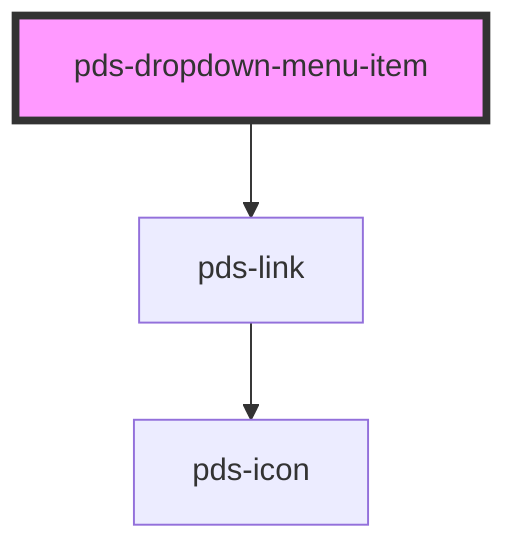

# pds-dropdown-item

<!-- Auto Generated Below -->

## Properties

| Property      | Attribute      | Description                                                                                                                                                                                                                                    | Type                                         | Default     |
| ------------- | -------------- | ---------------------------------------------------------------------------------------------------------------------------------------------------------------------------------------------------------------------------------------------- | -------------------------------------------- | ----------- |
| `componentId` | `component-id` | A unique identifier used for the underlying component `id` attribute.                                                                                                                                                                          | `string`                                     | `undefined` |
| `destructive` | `destructive`  | It determines whether or not the dropdown-item is destructive.                                                                                                                                                                                 | `boolean`                                    | `false`     |
| `disabled`    | `disabled`     | It determines whether or not the dropdown-item is disabled.                                                                                                                                                                                    | `boolean`                                    | `false`     |
| `download`    | `download`     | Prompts the user to save the linked URL instead of navigating to it. Can be used without a value to download with the default filename, or with a string value to suggest a specific filename for the download. Only applies when href is set. | `string`                                     | `undefined` |
| `external`    | `external`     | Determines whether the link should open in a new tab and display an external icon. This is a simpler alternative to using `target="_blank"` for the common case.                                                                               | `boolean`                                    | `false`     |
| `href`        | `href`         | If provided, renders the dropdown-item as an anchor (`<a>`) element instead of a button.                                                                                                                                                       | `string`                                     | `undefined` |
| `target`      | `target`       | Specifies where to open the linked document when href is provided. Takes precedence over the `external` prop if both are set. Only applies when href is set.                                                                                   | `"_blank" \| "_parent" \| "_self" \| "_top"` | `undefined` |

## Events

| Event      | Description                                | Type                                                                                         |
| ---------- | ------------------------------------------ | -------------------------------------------------------------------------------------------- |
| `pdsClick` | Emitted when the dropdown-item is clicked. | `CustomEvent<{ itemIndex: number; item: HTMLPdsDropdownMenuItemElement; content: string; }>` |

## Methods

### `clickItem() => Promise<void>`

Trigger the click event

#### Returns

Type: `Promise<void>`

## Dependencies

### Depends on

- [pds-link](../../pds-link)

### Graph

----------------------------------------------

