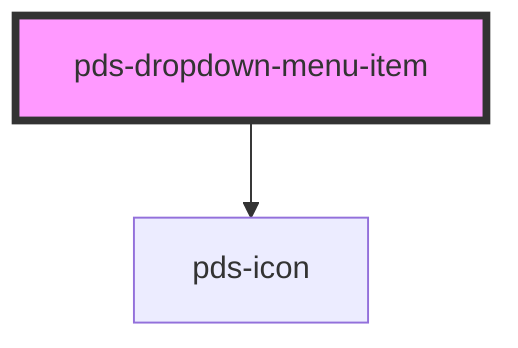

# pds-dropdown-item

<!-- Auto Generated Below -->

## Properties

| Property      | Attribute      | Description                                                                                                                                                                                                                                                                                | Type                                              | Default     |
| ------------- | -------------- | ------------------------------------------------------------------------------------------------------------------------------------------------------------------------------------------------------------------------------------------------------------------------------------------ | ------------------------------------------------- | ----------- |
| `componentId` | `component-id` | A unique identifier used for the underlying component `id` attribute.                                                                                                                                                                                                                      | `string`                                          | `undefined` |
| `destructive` | `destructive`  | It determines whether or not the dropdown-item is destructive.                                                                                                                                                                                                                             | `boolean`                                         | `false`     |
| `disabled`    | `disabled`     | It determines whether or not the dropdown-item is disabled.                                                                                                                                                                                                                                | `boolean`                                         | `false`     |
| `external`    | `external`     | Determines whether the link should open in a new tab and display an external icon. This is a simpler alternative to using `target="_blank"` for the common case.                                                                                                                           | `boolean`                                         | `false`     |
| `href`        | `href`         | If provided, renders the dropdown-item as an anchor (`<a>`) element instead of a button.                                                                                                                                                                                                   | `string`                                          | `undefined` |
| `httpMethod`  | `http-method`  | HTTP method to use for link navigation. For non-GET methods (post, put, patch, delete), the component will handle form submission internally. Also adds data-method and data-turbo-method attributes to the internal anchor for framework integration. Only applies when href is provided. | `"delete" \| "get" \| "patch" \| "post" \| "put"` | `undefined` |
| `target`      | `target`       | Specifies where to open the linked document when href is provided. Takes precedence over the `external` prop if both are set. Only applies when href is set.                                                                                                                               | `"_blank" \| "_parent" \| "_self" \| "_top"`      | `undefined` |
| `turbo`       | `turbo`        | Sets data-turbo attribute on the internal anchor. Useful for enabling or disabling framework-specific navigation handling. Only applies when href is provided.                                                                                                                             | `boolean`                                         | `undefined` |
| `turboFrame`  | `turbo-frame`  | Sets data-turbo-frame attribute on the internal anchor. Useful for framework integration with frame-based navigation. Only applies when href is provided.                                                                                                                                  | `string`                                          | `undefined` |

## Events

| Event             | Description                                                                                                                                                                                            | Type                                                                                         |
| ----------------- | ------------------------------------------------------------------------------------------------------------------------------------------------------------------------------------------------------ | -------------------------------------------------------------------------------------------- |
| `pdsBeforeSubmit` | Emitted before form submission for non-GET http methods. Call event.preventDefault() to cancel the submission and handle it yourself. Useful for custom confirmation dialogs or app-specific handling. | `CustomEvent<{ href: string; method: string; }>`                                             |
| `pdsClick`        | Emitted when the dropdown-item is clicked.                                                                                                                                                             | `CustomEvent<{ itemIndex: number; item: HTMLPdsDropdownMenuItemElement; content: string; }>` |

## Methods

### `clickItem() => Promise<void>`

Trigger the click event

#### Returns

Type: `Promise<void>`

## Dependencies

### Depends on

- pds-icon

### Graph

----------------------------------------------

