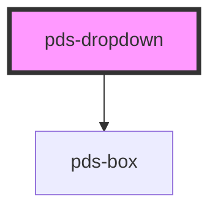

# pds-dropdown

<!-- Auto Generated Below -->

## Properties

| Property      | Attribute      | Description                                                           | Type                                                                                                                                                                 | Default          |
| ------------- | -------------- | --------------------------------------------------------------------- | -------------------------------------------------------------------------------------------------------------------------------------------------------------------- | ---------------- |
| `componentId` | `component-id` | A unique identifier used for the underlying component `id` attribute. | `string`                                                                                                                                                             | `undefined`      |
| `placement`   | `placement`    | The placement of the dropdown panel relative to the trigger.          | `"bottom" \| "bottom-end" \| "bottom-start" \| "left" \| "left-end" \| "left-start" \| "right" \| "right-end" \| "right-start" \| "top" \| "top-end" \| "top-start"` | `'bottom-start'` |

## Dependencies

### Depends on

- [pds-box](../pds-box)

### Graph

----------------------------------------------

