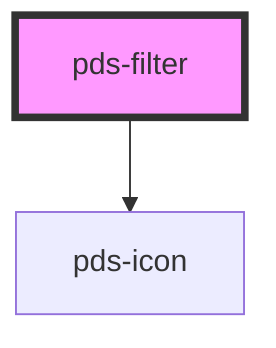

# pds-filter

<!-- Auto Generated Below -->

## Properties

| Property                   | Attribute      | Description                                                                                                                | Type                                           | Default     |
| -------------------------- | -------------- | -------------------------------------------------------------------------------------------------------------------------- | ---------------------------------------------- | ----------- |
| `componentId` _(required)_ | `component-id` | A unique identifier used for the underlying component `id` attribute.                                                      | `string`                                       | `undefined` |
| `icon`                     | `icon`         | The name of the icon to display in the trigger button. For 'clear' variant, this is ignored as it always shows trash icon. | `string`                                       | `undefined` |
| `text`                     | `text`         | The text content displayed in the trigger button.                                                                          | `string`                                       | `undefined` |
| `variant`                  | `variant`      | The variant style of the filter trigger.                                                                                   | `"clear" \| "default" \| "more" \| "selected"` | `'default'` |

## Events

| Event            | Description                                      | Type                                     |
| ---------------- | ------------------------------------------------ | ---------------------------------------- |
| `pdsFilterClear` | Event emitted when the clear variant is clicked. | `CustomEvent<PdsFilterClearEventDetail>` |
| `pdsFilterClose` | Event emitted when the filter popover is closed. | `CustomEvent<PdsFilterCloseEventDetail>` |
| `pdsFilterOpen`  | Event emitted when the filter popover is opened. | `CustomEvent<PdsFilterOpenEventDetail>`  |

## Methods

### `hideFilter() => Promise<void>`

Closes the filter popover programmatically.
Note: Clear variant does not support popover functionality.

#### Returns

Type: `Promise<void>`

### `showFilter() => Promise<void>`

Opens the filter popover programmatically.
Note: Clear variant does not support popover functionality.

#### Returns

Type: `Promise<void>`

## Slots

| Slot          | Description                                                     |
| ------------- | --------------------------------------------------------------- |
| `"(default)"` | Popover content that will be displayed when the filter is open. |

## Shadow Parts

| Part               | Description                                       |
| ------------------ | ------------------------------------------------- |
| `"button"`         | Exposes the trigger button element for styling.   |
| `"button-content"` | Exposes the button content container for styling. |
| `"button-text"`    | Exposes the button text for styling.              |
| `"icon"`           | Exposes the icon component for styling.           |
| `"popover"`        | Exposes the popover container for styling.        |

## Dependencies

### Depends on

- pds-icon

### Graph

----------------------------------------------

