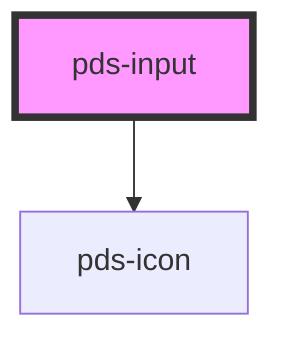

# pds-input

<!-- Auto Generated Below -->

## Properties

| Property                   | Attribute        | Description                                                                                                           | Type               | Default     |
| -------------------------- | ---------------- | --------------------------------------------------------------------------------------------------------------------- | ------------------ | ----------- |
| `autocomplete`             | `autocomplete`   | Specifies if and how the browser provides `autocomplete` assistance for the field.                                    | `string`           | `undefined` |
| `componentId` _(required)_ | `component-id`   | A unique identifier used for the underlying component `id` attribute.                                                 | `string`           | `undefined` |
| `debounce`                 | `debounce`       | Sets the number of milliseconds to wait before updating the value.                                                    | `number`           | `undefined` |
| `disabled`                 | `disabled`       | Determines whether or not the input field is disabled.                                                                | `boolean`          | `undefined` |
| `errorMessage`             | `error-message`  | Specifies the error message and provides an error-themed treatment to the field.                                      | `string`           | `undefined` |
| `helperMessage`            | `helper-message` | Displays a message or hint below the input field.                                                                     | `string`           | `undefined` |
| `invalid`                  | `invalid`        | Determines whether or not the input field is invalid or throws an error.                                              | `boolean`          | `undefined` |
| `label`                    | `label`          | Text to be displayed as the input label.                                                                              | `string`           | `undefined` |
| `name`                     | `name`           | Specifies the name. Submitted with the form name/value pair.                                                          | `string`           | `undefined` |
| `placeholder`              | `placeholder`    | Specifies a short hint that describes the expected value of the input field.                                          | `string`           | `undefined` |
| `readonly`                 | `readonly`       | Determines whether or not the input field is readonly.                                                                | `boolean`          | `undefined` |
| `required`                 | `required`       | Determines whether or not the input field is required.                                                                | `boolean`          | `undefined` |
| `type`                     | `type`           | Determines the type of control that will be displayed `'email'`, `'number'`, `'password'`, `'tel'`, `'text'`, `'url'` | `string`           | `'text'`    |
| `value`                    | `value`          | The value of the input.                                                                                               | `number \| string` | `''`        |

## Events

| Event       | Description                                                                                                       | Type                                  |
| ----------- | ----------------------------------------------------------------------------------------------------------------- | ------------------------------------- |
| `pdsBlur`   | Emitted when the input loses focus.                                                                               | `CustomEvent<FocusEvent>`             |
| `pdsChange` | Emitted when the value has changed.  This event will not emit when programmatically setting the `value` property. | `CustomEvent<InputChangeEventDetail>` |
| `pdsFocus`  | Emitted when the input has focus.                                                                                 | `CustomEvent<FocusEvent>`             |
| `pdsInput`  | Emitted when a keyboard input occurs.                                                                             | `CustomEvent<InputInputEventDetail>`  |

## Methods

### `setFocus() => Promise<void>`

Sets focus on the native `input` in the `pds-input`. Use this method instead of the global
`input.focus()`.

#### Returns

Type: `Promise<void>`

## Shadow Parts

| Part        | Description |
| ----------- | ----------- |
| `"append"`  |             |
| `"prefix"`  |             |
| `"prepend"` |             |
| `"suffix"`  |             |

## Dependencies

### Depends on

- pds-icon

### Graph

----------------------------------------------

