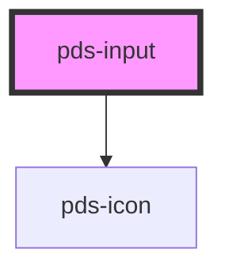

# pds-input


<!-- Auto Generated Below -->


## Overview

PdsInput - A form input component with validation and accessibility

**⚠️ VISUAL PATTERN CLARIFICATION:**

When analyzing screenshots or visual layouts:
- **Text above input field**: This is the input's LABEL, not a separate `pds-text` component
- **Label Integration**: The `label` prop creates text that appears above the input field
- **No Separate Text Needed**: Do not add `pds-text` components for input labels
- **Visual Hierarchy**: Label text is styled and positioned automatically by the input component

**Common Mistake**: Seeing text above an input and assuming it's a separate `pds-text` component
**Correct Understanding**: The text is the input's integrated label created by the `label` prop

**Usage Examples:**
```tsx
// Basic input
<pds-input label="Name" component-id="name" required></pds-input>

// Input with validation
<pds-input
  label="Email"
  component-id="email"
  type="email"
  required
  helper-message="We'll never share your email"
></pds-input>

// ❌ INCORRECT - Don't add separate text for labels
<pds-text>Name</pds-text>
<pds-input component-id="name"></pds-input>

// ✅ CORRECT - Use the label prop
<pds-input label="Name" component-id="name"></pds-input>
```

## Properties

| Property                   | Attribute        | Description                                                                                                                                                                                                                                                                                                                                                                                                                                                                                                                                                                                                                                                                                                                                             | Type               | Default     |
| -------------------------- | ---------------- | ------------------------------------------------------------------------------------------------------------------------------------------------------------------------------------------------------------------------------------------------------------------------------------------------------------------------------------------------------------------------------------------------------------------------------------------------------------------------------------------------------------------------------------------------------------------------------------------------------------------------------------------------------------------------------------------------------------------------------------------------------- | ------------------ | ----------- |
| `autocomplete`             | `autocomplete`   | Specifies if and how the browser provides `autocomplete` assistance for the field.                                                                                                                                                                                                                                                                                                                                                                                                                                                                                                                                                                                                                                                                      | `string`           | `undefined` |
| `componentId` _(required)_ | `component-id`   | A unique identifier used for the underlying component `id` attribute.                                                                                                                                                                                                                                                                                                                                                                                                                                                                                                                                                                                                                                                                                   | `string`           | `undefined` |
| `debounce`                 | `debounce`       | Sets the number of milliseconds to wait before updating the value.                                                                                                                                                                                                                                                                                                                                                                                                                                                                                                                                                                                                                                                                                      | `number`           | `undefined` |
| `disabled`                 | `disabled`       | Determines whether or not the input field is disabled.                                                                                                                                                                                                                                                                                                                                                                                                                                                                                                                                                                                                                                                                                                  | `boolean`          | `undefined` |
| `errorMessage`             | `error-message`  | Specifies the error message and provides an error-themed treatment to the field.                                                                                                                                                                                                                                                                                                                                                                                                                                                                                                                                                                                                                                                                        | `string`           | `undefined` |
| `fullWidth`                | `full-width`     | Determines whether or not the input field takes full width of its container.  **Layout Impact:** - Makes input span 100% width of parent container - Useful for mobile layouts or form consistency - Works with all input types and states - Affects input field only, not label or messages  **Best Practice**: Use for form layouts where consistent width is needed  **Example**: `full-width="true"` for mobile-friendly forms                                                                                                                                                                                                                                                                                                                      | `boolean`          | `undefined` |
| `helperMessage`            | `helper-message` | Displays a message or hint below the input field.                                                                                                                                                                                                                                                                                                                                                                                                                                                                                                                                                                                                                                                                                                       | `string`           | `undefined` |
| `invalid`                  | `invalid`        | Determines whether or not the input field is invalid or throws an error.                                                                                                                                                                                                                                                                                                                                                                                                                                                                                                                                                                                                                                                                                | `boolean`          | `undefined` |
| `label`                    | `label`          | Text to be displayed as the input label.                                                                                                                                                                                                                                                                                                                                                                                                                                                                                                                                                                                                                                                                                                                | `string`           | `undefined` |
| `max`                      | `max`            | Specifies the maximum value for the input field.                                                                                                                                                                                                                                                                                                                                                                                                                                                                                                                                                                                                                                                                                                        | `string`           | `undefined` |
| `maxlength`                | `maxlength`      | Specifies the maximum number of characters allowed in the input field.                                                                                                                                                                                                                                                                                                                                                                                                                                                                                                                                                                                                                                                                                  | `string`           | `undefined` |
| `min`                      | `min`            | Specifies the minimum value for the input field.                                                                                                                                                                                                                                                                                                                                                                                                                                                                                                                                                                                                                                                                                                        | `string`           | `undefined` |
| `minlength`                | `minlength`      | Specifies the minimum number of characters allowed in the input field.                                                                                                                                                                                                                                                                                                                                                                                                                                                                                                                                                                                                                                                                                  | `string`           | `undefined` |
| `name`                     | `name`           | Specifies the name. Submitted with the form name/value pair.                                                                                                                                                                                                                                                                                                                                                                                                                                                                                                                                                                                                                                                                                            | `string`           | `undefined` |
| `pattern`                  | `pattern`        | Specifies the regular expression that the input value is checked against.                                                                                                                                                                                                                                                                                                                                                                                                                                                                                                                                                                                                                                                                               | `string`           | `undefined` |
| `placeholder`              | `placeholder`    | Specifies a short hint that describes the expected value of the input field.                                                                                                                                                                                                                                                                                                                                                                                                                                                                                                                                                                                                                                                                            | `string`           | `undefined` |
| `readonly`                 | `readonly`       | Determines whether or not the input field is readonly.                                                                                                                                                                                                                                                                                                                                                                                                                                                                                                                                                                                                                                                                                                  | `boolean`          | `undefined` |
| `required`                 | `required`       | Determines whether or not the input field is required.                                                                                                                                                                                                                                                                                                                                                                                                                                                                                                                                                                                                                                                                                                  | `boolean`          | `undefined` |
| `step`                     | `step`           | Works with the `min` and `max` attributes to define increments for the input field.                                                                                                                                                                                                                                                                                                                                                                                                                                                                                                                                                                                                                                                                     | `string`           | `undefined` |
| `type`                     | `type`           | Determines the type of control that will be displayed  **Input Types:** - `text`: Standard text input (default) - `email`: Email validation and mobile keyboard - `password`: Hidden text with security features - `number`: Numeric input with min/max/step validation - `tel`: Telephone input with mobile keyboard - `url`: URL validation and mobile keyboard  **Type-Specific Features:** - **email**: Browser email validation, mobile email keyboard - **password**: Hidden characters, security features - **number**: Up/down arrows, min/max validation - **tel**: Mobile phone keyboard, pattern validation - **url**: Browser URL validation, mobile URL keyboard  **Best Practice**: Choose type that matches expected input for better UX | `string`           | `'text'`    |
| `value`                    | `value`          | The value of the input.                                                                                                                                                                                                                                                                                                                                                                                                                                                                                                                                                                                                                                                                                                                                 | `number \| string` | `''`        |


## Events

| Event       | Description                                                                                                                                                                                                                                                                                                                                                                                                   | Type                                  |
| ----------- | ------------------------------------------------------------------------------------------------------------------------------------------------------------------------------------------------------------------------------------------------------------------------------------------------------------------------------------------------------------------------------------------------------------- | ------------------------------------- |
| `pdsBlur`   | Emitted when the input loses focus.                                                                                                                                                                                                                                                                                                                                                                           | `CustomEvent<FocusEvent>`             |
| `pdsChange` | Emitted when the value has changed.  **Event Behavior:** - Fires when value changes and input loses focus - Does not emit when programmatically setting the `value` property - Provides value and original event object - Used for form submission and final value handling  **Best Practice**: Use for form submission and final value processing  **Example**: `<pds-input onPdsChange={handleFormChange}>` | `CustomEvent<InputChangeEventDetail>` |
| `pdsFocus`  | Emitted when the input has focus.                                                                                                                                                                                                                                                                                                                                                                             | `CustomEvent<FocusEvent>`             |
| `pdsInput`  | Emitted when a keyboard input occurs.                                                                                                                                                                                                                                                                                                                                                                         | `CustomEvent<InputInputEventDetail>`  |


## Methods

### `setFocus() => Promise<void>`

Sets focus on the native `input` in the `pds-input`. Use this method instead of the global
`input.focus()`.

#### Returns

Type: `Promise<void>`


## Slots

| Slot        | Description                                                                      |
| ----------- | -------------------------------------------------------------------------------- |
| `"action"`  | Content to be displayed in the label area, typically for help icons or links     |
| `"append"`  | Content to be displayed after the input field                                    |
| `"prefix"`  | Content that is displayed visually within the input field before the input field |
| `"prepend"` | Content to be displayed before the input field                                   |
| `"suffix"`  | Content that is displayed visually within the input field after the input field  |


## Shadow Parts

| Part        | Description |
| ----------- | ----------- |
| `"action"`  |             |
| `"append"`  |             |
| `"prefix"`  |             |
| `"prepend"` |             |
| `"suffix"`  |             |


## Dependencies

### Depends on

- pds-icon

### Graph


----------------------------------------------


