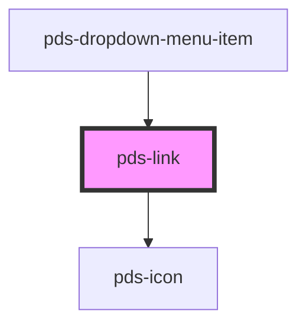

# pds-link

Link is mainly used as navigational element and usually appear within or directly following a paragraph or sentence. The "plain link" is used for interactive user generated text like product, post, and offer titles.

<!-- Auto Generated Below -->

## Properties

| Property            | Attribute      | Description                                                                                                                                                                                                                | Type                                         | Default     |
| ------------------- | -------------- | -------------------------------------------------------------------------------------------------------------------------------------------------------------------------------------------------------------------------- | -------------------------------------------- | ----------- |
| `color`             | `color`        | Sets the link color.                                                                                                                                                                                                       | `string`                                     | `undefined` |
| `componentId`       | `component-id` | A unique identifier used for the underlying component `id` attribute.                                                                                                                                                      | `string`                                     | `undefined` |
| `external`          | `external`     | **[DEPRECATED]** Consider using the `target` prop for more control. This prop will be maintained for backward compatibility.  Determines whether the link should open in a new tab. | `boolean`                                    | `false`     |
| `fontSize`          | `font-size`    | The font size of the link's text.                                                                                                                                                                                          | `"lg" \| "md" \| "sm"`                       | `'lg'`      |
| `href` _(required)_ | `href`         | The hyperlink's destination URL. If no text is provided in the custom slot, the href will be used.                                                                                                                         | `string`                                     | `undefined` |
| `target`            | `target`       | Specifies where to open the linked document. Takes precedence over the external prop if both are set. When set to `_blank`, automatically displays an external icon.                                                       | `"_blank" \| "_parent" \| "_self" \| "_top"` | `undefined` |
| `variant`           | `variant`      | Sets the link variant styles.                                                                                                                                                                                              | `"inline" \| "plain"`                        | `'inline'`  |

## Slots

| Slot          | Description                                                                                                                |
| ------------- | -------------------------------------------------------------------------------------------------------------------------- |
| `"(default)"` | Text content placed between the opening and closing tags. If no text is provided, the **href** will be used as a fallback. |

## Shadow Parts

| Part     | Description          |
| -------- | -------------------- |
| `"link"` | Link element styles. |

## Dependencies

### Used by

 - [pds-dropdown-menu-item](../pds-dropdown-menu/pds-dropdown-menu-item)

### Depends on

- pds-icon

### Graph

----------------------------------------------

