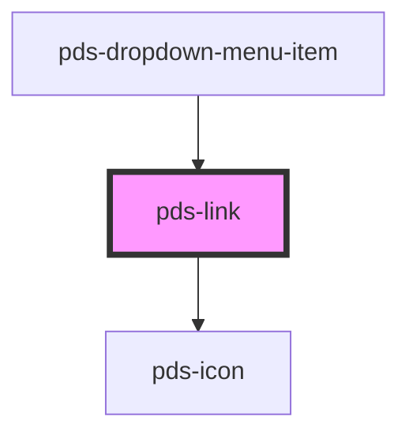

# pds-link

Link is mainly used as navigational element and usually appear within or directly following a paragraph or sentence. The "plain link" is used for interactive user generated text like product, post, and offer titles.

<!-- Auto Generated Below -->

## Properties

| Property            | Attribute        | Description                                                                                                                                                                                                                | Type                                              | Default     |
| ------------------- | ---------------- | -------------------------------------------------------------------------------------------------------------------------------------------------------------------------------------------------------------------------- | ------------------------------------------------- | ----------- |
| `color`             | `color`          | Sets the link color.                                                                                                                                                                                                       | `string`                                          | `undefined` |
| `componentId`       | `component-id`   | A unique identifier used for the underlying component `id` attribute.                                                                                                                                                      | `string`                                          | `undefined` |
| `download`          | `download`       | Prompts the user to save the linked URL instead of navigating to it. It can be used without a value to download with the default filename, or with a string value to suggest a specific filename for the download.         | `string`                                          | `undefined` |
| `external`          | `external`       | **[DEPRECATED]** Consider using the `target` prop for more control. This prop will be maintained for backward compatibility.  Determines whether the link should open in a new tab. | `boolean`                                         | `false`     |
| `fontSize`          | `font-size`      | The font size of the link's text.                                                                                                                                                                                          | `"lg" \| "md" \| "sm"`                            | `'lg'`      |
| `href` _(required)_ | `href`           | The hyperlink's destination URL. If no text is provided in the custom slot, the href will be used.                                                                                                                         | `string`                                          | `undefined` |
| `target`            | `target`         | Specifies where to open the linked document.                                                                                                                                                                               | `"_blank" \| "_parent" \| "_self" \| "_top"`      | `undefined` |
| `turbo`             | `turbo`          | Enables or disables Turbo Drive for this link. Maps to the `data-turbo` attribute on the inner anchor element.                                                                                                             | `string`                                          | `undefined` |
| `turboAction`       | `turbo-action`   | Controls the Turbo visit action type. Maps to the `data-turbo-action` attribute on the inner anchor element.                                                                                                               | `"advance" \| "replace"`                          | `undefined` |
| `turboConfirm`      | `turbo-confirm`  | Displays a confirmation dialog before navigating. Maps to the `data-turbo-confirm` attribute on the inner anchor element.                                                                                                  | `string`                                          | `undefined` |
| `turboFrame`        | `turbo-frame`    | Specifies the Turbo Frame to target for navigation. Maps to the `data-turbo-frame` attribute on the inner anchor element.                                                                                                  | `string`                                          | `undefined` |
| `turboMethod`       | `turbo-method`   | Changes the HTTP method for the link request. Maps to the `data-turbo-method` attribute on the inner anchor element.                                                                                                       | `"delete" \| "get" \| "patch" \| "post" \| "put"` | `undefined` |
| `turboPrefetch`     | `turbo-prefetch` | Controls link prefetching on hover. Maps to the `data-turbo-prefetch` attribute on the inner anchor element.                                                                                                               | `string`                                          | `undefined` |
| `turboPreload`      | `turbo-preload`  | Eagerly preloads the link's destination into cache. Maps to the `data-turbo-preload` attribute on the inner anchor element.                                                                                                | `string`                                          | `undefined` |
| `turboStream`       | `turbo-stream`   | Accepts Turbo Stream responses for GET requests. Maps to the `data-turbo-stream` attribute on the inner anchor element.                                                                                                    | `string`                                          | `undefined` |
| `variant`           | `variant`        | Sets the link variant styles.                                                                                                                                                                                              | `"inline" \| "plain"`                             | `'inline'`  |

## Slots

| Slot          | Description                                                                                                                |
| ------------- | -------------------------------------------------------------------------------------------------------------------------- |
| `"(default)"` | Text content placed between the opening and closing tags. If no text is provided, the **href** will be used as a fallback. |

## Shadow Parts

| Part     | Description          |
| -------- | -------------------- |
| `"link"` | Link element styles. |

## Dependencies

### Used by

 - [pds-dropdown-menu-item](../pds-dropdown-menu/pds-dropdown-menu-item)

### Depends on

- pds-icon

### Graph

```mermaid
graph TD;
  pds-link --> pds-icon
  pds-dropdown-menu-item --> pds-link
  style pds-link fill:#f9f,stroke:#333,stroke-width:4px
```

----------------------------------------------

