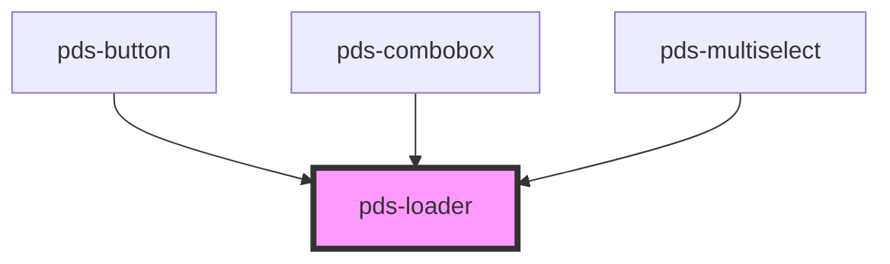

# pds-loader

<!-- Auto Generated Below -->

## Properties

| Property    | Attribute    | Description                                                         | Type                    | Default     |
| ----------- | ------------ | ------------------------------------------------------------------- | ----------------------- | ----------- |
| `isLoading` | `is-loading` | If false, the loader will be hidden.                                | `boolean`               | `true`      |
| `showLabel` | `show-label` | Determines whether the loader should display a label.               | `boolean`               | `false`     |
| `size`      | `size`       | Sets the size of the spinner loader. Value can be preset or custom. | `string`                | `'md'`      |
| `variant`   | `variant`    | Determines the type of loader.                                      | `"spinner" \| "typing"` | `'spinner'` |

## Slots

| Slot      | Description                         |
| --------- | ----------------------------------- |
| `"label"` | Default slot for Loader label text. |

## Shadow Parts

| Part           | Description                                              |
| -------------- | -------------------------------------------------------- |
| `"loader-svg"` | Exposes the spinner SVG element for color customization. |

## Dependencies

### Used by

- [pds-button](../pds-button)
- [pds-combobox](../pds-combobox)
- [pds-multiselect](../pds-multiselect)

### Graph

----------------------------------------------

