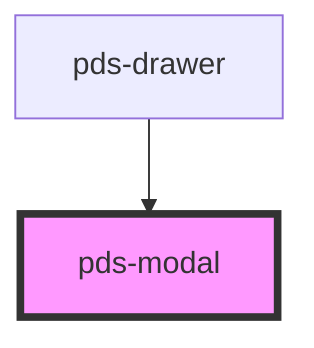

# pds-modal

<!-- Auto Generated Below -->

## Properties

| Property              | Attribute               | Description                                                                                                                                                                                                                                                                                                                                                                                                                                                                                                                                                                  | Type                                                                    | Default     |
| --------------------- | ----------------------- | ---------------------------------------------------------------------------------------------------------------------------------------------------------------------------------------------------------------------------------------------------------------------------------------------------------------------------------------------------------------------------------------------------------------------------------------------------------------------------------------------------------------------------------------------------------------------------- | ----------------------------------------------------------------------- | ----------- |
| `backdropDismiss`     | `backdrop-dismiss`      | Whether the modal can be dismissed by clicking the backdrop                                                                                                                                                                                                                                                                                                                                                                                                                                                                                                                  | `boolean`                                                               | `true`      |
| `componentId`         | `component-id`          | A unique identifier used for the underlying component `id` attribute.                                                                                                                                                                                                                                                                                                                                                                                                                                                                                                        | `string`                                                                | `undefined` |
| `disableInitialFocus` | `disable-initial-focus` | Whether to skip moving focus into the modal when it opens — both our own `setInitialFocus()` and the browser's native "dialog focusing steps", which move focus into the dialog as soon as `show()`/`showModal()` is called regardless of application code. Focus return on close is unaffected either way. For a modal opened by something other than a direct user click — a redirect, a deep link, a background event — stealing focus on open can interrupt whatever the user was already doing. Default `false` preserves today's behavior for every existing consumer. | `boolean`                                                               | `false`     |
| `disableTopLayer`     | `disable-top-layer`     | Whether the modal opens outside the browser top layer as a non-modal dialog. When `true` it opens with `dialog.show()` instead of `dialog.showModal()`, so overlays rendered elsewhere in the DOM (file pickers, editor menus) can display above it via `z-index`. The page is not made inert and focus is not trapped in this mode. Read when the modal opens; changing it while the modal is open is not supported.                                                                                                                                                        | `boolean`                                                               | `false`     |
| `open`                | `open`                  | Whether the modal is open                                                                                                                                                                                                                                                                                                                                                                                                                                                                                                                                                    | `boolean`                                                               | `false`     |
| `scrollable`          | `scrollable`            | Whether the modal content should be scrollable                                                                                                                                                                                                                                                                                                                                                                                                                                                                                                                               | `boolean`                                                               | `true`      |
| `size`                | `size`                  | The size of the modal. Can be a predefined value ('sm', 'md', 'lg', 'fullscreen') or a custom max-width as a CSS length (e.g., '1250px', '80vw'). A custom width stays fluid below that size. A value that is neither falls back to 'md'.                                                                                                                                                                                                                                                                                                                                    | `"fullscreen" \| "lg" \| "md" \| "sm" \| string & Record<never, never>` | `'md'`      |

## Events

| Event           | Description                      | Type                |
| --------------- | -------------------------------- | ------------------- |
| `pdsModalClose` | Emitted when the modal is closed | `CustomEvent<void>` |
| `pdsModalOpen`  | Emitted when the modal is opened | `CustomEvent<void>` |

## Methods

### `hideModal() => Promise<void>`

Closes the modal

#### Returns

Type: `Promise<void>`

### `showModal() => Promise<void>`

Opens the modal

#### Returns

Type: `Promise<void>`

## Shadow Parts

| Part      | Description |
| --------- | ----------- |
| `"modal"` |             |

## Dependencies

### Used by

 - [pds-drawer](../pds-drawer)

### Graph

----------------------------------------------

