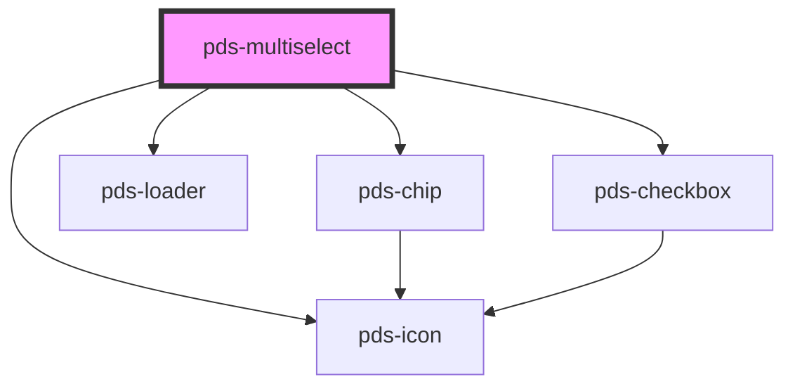

# pds-multiselect

A multiselect component that allows users to select multiple options from a searchable dropdown list. Selected items are displayed as removable chips in a Select2-style pillbox interface.

## Features

- **Pillbox UI**: Selected items appear as removable chips inside the input container
- **Typeahead Search**: Filter options as you type
- **Checkbox Options**: Clear selection state with real checkboxes in the dropdown
- **Async Support**: Fetch options from a URL endpoint or manage data externally
- **Infinite Scroll**: Automatic pagination when scrolling to the bottom
- **Keyboard Navigation**: Full keyboard support for accessibility
- **Form Integration**: Works with native forms and FormData

<!-- Auto Generated Below -->

## Properties

| Property                   | Attribute        | Description                                                           | Type                                   | Default       |
| -------------------------- | ---------------- | --------------------------------------------------------------------- | -------------------------------------- | ------------- |
| `asyncMethod`              | `async-method`   | HTTP method for async requests.                                       | `"GET" \| "POST"`                      | `'GET'`       |
| `asyncUrl`                 | `async-url`      | URL endpoint for async data fetching.                                 | `string`                               | `undefined`   |
| `componentId` _(required)_ | `component-id`   | A unique identifier used for the underlying component `id` attribute. | `string`                               | `undefined`   |
| `debounceMs`               | `debounce-ms`    | Debounce delay in milliseconds for search/fetch.                      | `number`                               | `300`         |
| `disabled`                 | `disabled`       | Whether the multiselect is disabled.                                  | `boolean`                              | `false`       |
| `errorMessage`             | `error-message`  | Error message to display.                                             | `string`                               | `undefined`   |
| `formatResult`             | --               | Function to format async results. Receives raw API response item.     | `(item: unknown) => MultiselectOption` | `undefined`   |
| `helperMessage`            | `helper-message` | Helper message to display below the input.                            | `string`                               | `undefined`   |
| `hideLabel`                | `hide-label`     | Visually hides the label but keeps it accessible.                     | `boolean`                              | `false`       |
| `invalid`                  | `invalid`        | Whether the component is in an invalid state.                         | `boolean`                              | `undefined`   |
| `label`                    | `label`          | Text to be displayed as the multiselect label.                        | `string`                               | `undefined`   |
| `loading`                  | `loading`        | Whether the component is currently loading async options.             | `boolean`                              | `false`       |
| `maxHeight`                | `max-height`     | Maximum height of the dropdown before scrolling.                      | `string`                               | `'300px'`     |
| `maxSelections`            | `max-selections` | Maximum number of selections allowed.                                 | `number`                               | `undefined`   |
| `name`                     | `name`           | The name of the form control for form submission.                     | `string`                               | `undefined`   |
| `options`                  | --               | Options provided externally (for consumer-managed async).             | `MultiselectOption[]`                  | `undefined`   |
| `placeholder`              | `placeholder`    | Placeholder text for the search input.                                | `string`                               | `'Select...'` |
| `required`                 | `required`       | Whether the multiselect is required.                                  | `boolean`                              | `false`       |
| `value`                    | --               | Array of selected option values.                                      | `string[]`                             | `[]`          |

## Events

| Event                       | Description                                           | Type                                             |
| --------------------------- | ----------------------------------------------------- | ------------------------------------------------ |
| `pdsMultiselectChange`      | Emitted when selection changes.                       | `CustomEvent<MultiselectChangeEventDetail>`      |
| `pdsMultiselectLoadOptions` | Emitted to request more options (pagination).         | `CustomEvent<MultiselectLoadOptionsEventDetail>` |
| `pdsMultiselectSearch`      | Emitted on search input (for consumer-managed async). | `CustomEvent<MultiselectSearchEventDetail>`      |

## Methods

### `setFocus() => Promise<void>`

Sets focus on the search input.

#### Returns

Type: `Promise<void>`

## Slots

| Slot          | Description                                      |
| ------------- | ------------------------------------------------ |
| `"(default)"` | Static option elements for the multiselect       |
| `"empty"`     | Custom empty state message when no options match |
| `"loading"`   | Custom loading indicator                         |

## Dependencies

### Depends on

- [pds-chip](../pds-chip)
- [pds-loader](../pds-loader)
- [pds-checkbox](../pds-checkbox)
- pds-icon

### Graph

----------------------------------------------

