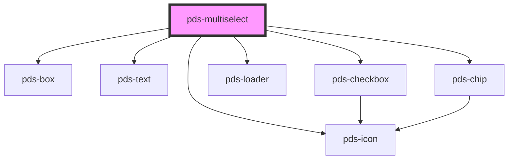

# pds-multiselect

A multiselect component that allows users to select multiple options from a searchable dropdown list. Selected items are displayed as removable chips in a Select2-style pillbox interface.

## Features

- **Pillbox UI**: Selected items appear as removable chips inside the input container
- **Typeahead Search**: Filter options as you type
- **Checkbox Options**: Clear selection state with real checkboxes in the dropdown
- **Async Support**: Fetch options from a URL endpoint or manage data externally
- **Infinite Scroll**: Automatic pagination when scrolling to the bottom
- **Keyboard Navigation**: Full keyboard support for accessibility
- **Form Integration**: Works with native forms and FormData

<!-- Auto Generated Below -->

## Properties

| Property                   | Attribute               | Description                                                                                                                                                                                                                                                | Type                                   | Default          |
| -------------------------- | ----------------------- | ---------------------------------------------------------------------------------------------------------------------------------------------------------------------------------------------------------------------------------------------------------- | -------------------------------------- | ---------------- |
| `asyncMethod`              | `async-method`          | HTTP method for async requests.                                                                                                                                                                                                                            | `"GET" \| "POST"`                      | `'GET'`          |
| `asyncUrl`                 | `async-url`             | URL endpoint for async data fetching.                                                                                                                                                                                                                      | `string`                               | `undefined`      |
| `closePanelOnSelect`       | `close-panel-on-select` | Whether to close the panel after an option is selected. Defaults to `false` (panel stays open for multi-select).                                                                                                                                           | `boolean`                              | `false`          |
| `componentId` _(required)_ | `component-id`          | A unique identifier used for the underlying component `id` attribute.                                                                                                                                                                                      | `string`                               | `undefined`      |
| `createUrl`                | `create-url`            | URL endpoint for creating new options. When set, shows "Add" option when no matches found.                                                                                                                                                                 | `string`                               | `undefined`      |
| `csrfHeaderName`           | `csrf-header-name`      | CSRF header name for authenticated requests. Defaults to `X-CSRF-Token`.                                                                                                                                                                                   | `string`                               | `'X-CSRF-Token'` |
| `csrfToken`                | `csrf-token`            | CSRF token for authenticated requests. If not provided, attempts to read from meta tag.                                                                                                                                                                    | `string`                               | `undefined`      |
| `debounce`                 | `debounce`              | Debounce delay in milliseconds for search/fetch.                                                                                                                                                                                                           | `number`                               | `300`            |
| `disabled`                 | `disabled`              | Determines whether or not the multiselect is disabled.                                                                                                                                                                                                     | `boolean`                              | `false`          |
| `errorMessage`             | `error-message`         | Error message to display.                                                                                                                                                                                                                                  | `string`                               | `undefined`      |
| `fetchTimeout`             | `fetch-timeout`         | Timeout in milliseconds for async fetch requests.                                                                                                                                                                                                          | `number`                               | `30000`          |
| `formatResult`             | --                      | Function to format async results. Receives raw API response item.                                                                                                                                                                                          | `(item: unknown) => MultiselectOption` | `undefined`      |
| `helperMessage`            | `helper-message`        | Helper message to display below the input.                                                                                                                                                                                                                 | `string`                               | `undefined`      |
| `hideLabel`                | `hide-label`            | Visually hides the label but keeps it accessible.                                                                                                                                                                                                          | `boolean`                              | `false`          |
| `hideSelectedItems`        | `hide-selected-items`   | Hides the selected items summary section in the dropdown panel.                                                                                                                                                                                            | `boolean`                              | `false`          |
| `invalid`                  | `invalid`               | If true, the multiselect is in an invalid state.                                                                                                                                                                                                           | `boolean`                              | `undefined`      |
| `label`                    | `label`                 | Text to be displayed as the multiselect label.                                                                                                                                                                                                             | `string`                               | `undefined`      |
| `loading`                  | `loading`               | Whether the component is currently loading async options.                                                                                                                                                                                                  | `boolean`                              | `false`          |
| `maxHeight`                | `max-height`            | Maximum height of the dropdown before scrolling.                                                                                                                                                                                                           | `string`                               | `'300px'`        |
| `maxInlinePills`           | `max-inline-pills`      | Maximum chips shown inline before collapsing to a "+N more" badge. Only applies when `selectedDisplay='pill'` and `pillPosition='inline'`.                                                                                                                 | `number`                               | `3`              |
| `maxSelections`            | `max-selections`        | Maximum number of selections allowed.                                                                                                                                                                                                                      | `number`                               | `undefined`      |
| `minWidth`                 | `min-width`             | Minimum width of the dropdown panel.                                                                                                                                                                                                                       | `string`                               | `'250px'`        |
| `name`                     | `name`                  | Specifies the name. Submitted with the form as part of a name/value pair.                                                                                                                                                                                  | `string`                               | `undefined`      |
| `options`                  | --                      | Options provided externally (for consumer-managed async). When using `group` on options, keep each group block contiguous in the array. The same `group` label appearing again after other items produces a separate header (same as native `<optgroup>`). | `MultiselectOption[]`                  | `undefined`      |
| `panelWidth`               | `panel-width`           | Width of the dropdown panel. Defaults to the trigger width.                                                                                                                                                                                                | `string`                               | `undefined`      |
| `pillPosition`             | `pill-position`         | Controls where pill chips render when `selectedDisplay` is `'pill'`. `'inline'` places chips inside the trigger; `'below'` places chips in a flex-wrap row directly below the trigger.                                                                     | `"below" \| "inline"`                  | `'inline'`       |
| `placeholder`              | `placeholder`           | Placeholder text for the input field.                                                                                                                                                                                                                      | `string`                               | `'Select...'`    |
| `required`                 | `required`              | If true, the multiselect is required.                                                                                                                                                                                                                      | `boolean`                              | `false`          |
| `searchPlaceholder`        | `search-placeholder`    | Placeholder text for the search input inside the dropdown panel.                                                                                                                                                                                           | `string`                               | `'Find...'`      |
| `selectedDisplay`          | `selected-display`      | Controls how selected items are displayed outside the dropdown panel. `'count'` shows "N item(s)" text in the trigger (default). `'pill'` renders selected items as dismissible pds-chip tags.                                                             | `"count" \| "pill"`                    | `'count'`        |
| `triggerWidth`             | `trigger-width`         | Width of the trigger button (and reference for dropdown positioning).                                                                                                                                                                                      | `string`                               | `'100%'`         |
| `value`                    | --                      | Array of selected option values.                                                                                                                                                                                                                           | `string[]`                             | `[]`             |

## Events

| Event                       | Description                                                                                                                                                                                                                                                                                                                                                                                                                                                                                                                                                                                                      | Type                                             |
| --------------------------- | ---------------------------------------------------------------------------------------------------------------------------------------------------------------------------------------------------------------------------------------------------------------------------------------------------------------------------------------------------------------------------------------------------------------------------------------------------------------------------------------------------------------------------------------------------------------------------------------------------------------- | ------------------------------------------------ |
| `pdsMultiselectChange`      | Emitted when selection changes.                                                                                                                                                                                                                                                                                                                                                                                                                                                                                                                                                                                  | `CustomEvent<MultiselectChangeEventDetail>`      |
| `pdsMultiselectCreate`      | Emitted when a new option is created.                                                                                                                                                                                                                                                                                                                                                                                                                                                                                                                                                                            | `CustomEvent<MultiselectCreateEventDetail>`      |
| `pdsMultiselectDismiss`     | Emitted when the dropdown is dismissed via Escape key or click outside.  This event fires only when the user explicitly dismisses the panel without making a selection: - ✅ Fires: Pressing Escape key while dropdown is open - ✅ Fires: Clicking outside the component while dropdown is open - ❌ Does NOT fire: When panel closes due to selection (including when `closePanelOnSelect` is true) - ❌ Does NOT fire: When panel closes programmatically via `closeDropdown()`  Equivalent to Sage's `onEscapeHook`. Use this to restore parent UI state or run cleanup when the user cancels their interaction. | `CustomEvent<void>`                              |
| `pdsMultiselectLoadOptions` | Emitted to request more options (pagination).                                                                                                                                                                                                                                                                                                                                                                                                                                                                                                                                                                    | `CustomEvent<MultiselectLoadOptionsEventDetail>` |
| `pdsMultiselectSearch`      | Emitted on search input (for consumer-managed async).                                                                                                                                                                                                                                                                                                                                                                                                                                                                                                                                                            | `CustomEvent<MultiselectSearchEventDetail>`      |

## Methods

### `clear() => Promise<void>`

Clears all selected values and resets the component.

#### Returns

Type: `Promise<void>`

### `setFocus() => Promise<void>`

Sets focus on the trigger button.

#### Returns

Type: `Promise<void>`

## Slots

| Slot          | Description                                      |
| ------------- | ------------------------------------------------ |
| `"(default)"` | Static option elements for the multiselect       |
| `"empty"`     | Custom empty state message when no options match |
| `"loading"`   | Custom loading indicator                         |

## Shadow Parts

| Part        | Description                                      |
| ----------- | ------------------------------------------------ |
| `"trigger"` | The trigger button that opens the dropdown panel |

## Dependencies

### Depends on

- [pds-box](../pds-box)
- pds-icon
- [pds-text](../pds-text)
- [pds-checkbox](../pds-checkbox)
- [pds-loader](../pds-loader)
- [pds-chip](../pds-chip)

### Graph

```mermaid
graph TD;
  pds-multiselect --> pds-box
  pds-multiselect --> pds-icon
  pds-multiselect --> pds-text
  pds-multiselect --> pds-checkbox
  pds-multiselect --> pds-loader
  pds-multiselect --> pds-chip
  pds-checkbox --> pds-icon
  pds-chip --> pds-icon
  style pds-multiselect fill:#f9f,stroke:#333,stroke-width:4px
```

----------------------------------------------

