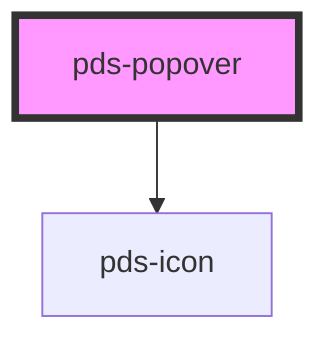

# pds-popover

<!-- Auto Generated Below -->

## Properties

| Property              | Attribute               | Description                                                           | Type               | Default     |
| --------------------- | ----------------------- | --------------------------------------------------------------------- | ------------------ | ----------- |
| `active`              | `active`                |                                                                       | `boolean`          | `false`     |
| `componentId`         | `component-id`          | A unique identifier used for the underlying component `id` attribute. | `string`           | `undefined` |
| `popoverTargetAction` | `popover-target-action` |                                                                       | `"hide" \| "show"` | `'show'`    |
| `text`                | `text`                  |                                                                       | `string`           | `undefined` |

## Events

| Event            | Description                                             | Type               |
| ---------------- | ------------------------------------------------------- | ------------------ |
| `hidePdsPopover` |                                                         | `CustomEvent<any>` |
| `showPdsPopover` | Emits a custom event when the popover should be hidden. | `CustomEvent<any>` |

## Dependencies

### Depends on

- pds-icon

### Graph

----------------------------------------------

