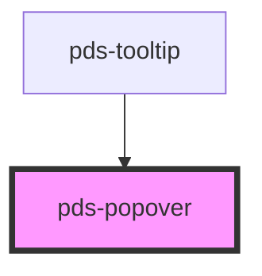

# pds-popover

<!-- Auto Generated Below -->

## Properties

| Property      | Attribute      | Description                                                                                                                                                                                                                                                                                                                                                                                                                                                                                                                                                                                                                              | Type                                                                                                                                                                 | Default     |
| ------------- | -------------- | ---------------------------------------------------------------------------------------------------------------------------------------------------------------------------------------------------------------------------------------------------------------------------------------------------------------------------------------------------------------------------------------------------------------------------------------------------------------------------------------------------------------------------------------------------------------------------------------------------------------------------------------- | -------------------------------------------------------------------------------------------------------------------------------------------------------------------- | ----------- |
| `arrow`       | --             |                                                                                                                                                                                                                                                                                                                                                                                                                                                                                                                                                                                                                                          | `HTMLElement`                                                                                                                                                        | `undefined` |
| `componentId` | `component-id` | A unique identifier used for the underlying component id attribute.                                                                                                                                                                                                                                                                                                                                                                                                                                                                                                                                                                      | `string`                                                                                                                                                             | `undefined` |
| `contentEl`   | --             |                                                                                                                                                                                                                                                                                                                                                                                                                                                                                                                                                                                                                                          | `HTMLElement`                                                                                                                                                        | `undefined` |
| `hasArrow`    | `has-arrow`    | Determines whether or not the popover has an arrow                                                                                                                                                                                                                                                                                                                                                                                                                                                                                                                                                                                       | `boolean`                                                                                                                                                            | `false`     |
| `hoisted`     | `hoisted`      | Determines how the popover is positioned relative to the trigger element. By default, the popover will use `absolute` positioning, which allows the popover to scroll with the page. Setting this to `fixed` handles most used. However, if the trigger element is within a container that has `overflow: hidden` set, the popover will not be able to escape the container and get clipped. In this case, you can set the `hoisted` property to `true` to use `fixed` positioning instead. **Be aware that this is less performant, as it requires recalculating the popover position on scroll. Only use this option if you need it.** | `boolean`                                                                                                                                                            | `false`     |
| `offset`      | `offset`       |                                                                                                                                                                                                                                                                                                                                                                                                                                                                                                                                                                                                                                          | `number`                                                                                                                                                             | `12`        |
| `opened`      | `opened`       | Determines whether or not the popover is visible                                                                                                                                                                                                                                                                                                                                                                                                                                                                                                                                                                                         | `boolean`                                                                                                                                                            | `false`     |
| `padding`     | `padding`      |                                                                                                                                                                                                                                                                                                                                                                                                                                                                                                                                                                                                                                          | `number`                                                                                                                                                             | `14`        |
| `placement`   | `placement`    | Determines the preferred position of the popover                                                                                                                                                                                                                                                                                                                                                                                                                                                                                                                                                                                         | `"bottom" \| "bottom-end" \| "bottom-start" \| "left" \| "left-end" \| "left-start" \| "right" \| "right-end" \| "right-start" \| "top" \| "top-end" \| "top-start"` | `'right'`   |
| `triggerEl`   | --             |                                                                                                                                                                                                                                                                                                                                                                                                                                                                                                                                                                                                                                          | `HTMLElement`                                                                                                                                                        | `undefined` |

## Events

| Event            | Description                       | Type               |
| ---------------- | --------------------------------- | ------------------ |
| `pdsPopoverHide` | Emitted after a popover is closed | `CustomEvent<any>` |
| `pdsPopoverShow` | Emitted after a popover is shown  | `CustomEvent<any>` |

## Methods

### `hidePdsPopover() => Promise<void>`

Hides the popover by disabling the opened property

#### Returns

Type: `Promise<void>`

### `showPdsPopover() => Promise<void>`

Shows the popover by enabling the opened property

#### Returns

Type: `Promise<void>`

### `togglePdsPopover() => Promise<void>`

Toggles the popover visibility on click

#### Returns

Type: `Promise<void>`

## Slots

| Slot          | Description                  |
| ------------- | ---------------------------- |
| `"(default)"` | The popover's target element |
| `"content"`   | HTML content for the popover |

## Shadow Parts

| Part        | Description |
| ----------- | ----------- |
| `"content"` |             |

## Dependencies

### Used by

 - [pds-tooltip](../pds-tooltip)

### Graph

----------------------------------------------

