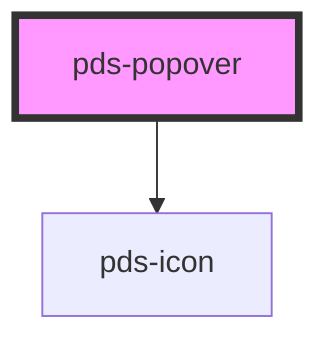

# pds-popover

<!-- Auto Generated Below -->

## Properties

| Property              | Attribute               | Description                                                           | Type                                                                                                                                                                 | Default     |
| --------------------- | ----------------------- | --------------------------------------------------------------------- | -------------------------------------------------------------------------------------------------------------------------------------------------------------------- | ----------- |
| `active`              | `active`                |                                                                       | `boolean`                                                                                                                                                            | `false`     |
| `componentId`         | `component-id`          | A unique identifier used for the underlying component `id` attribute. | `string`                                                                                                                                                             | `undefined` |
| `placement`           | `placement`             |                                                                       | `"bottom" \| "bottom-end" \| "bottom-start" \| "left" \| "left-end" \| "left-start" \| "right" \| "right-end" \| "right-start" \| "top" \| "top-end" \| "top-start"` | `'right'`   |
| `popoverTargetAction` | `popover-target-action` |                                                                       | `"hide" \| "show"`                                                                                                                                                   | `'show'`    |
| `text`                | `text`                  |                                                                       | `string`                                                                                                                                                             | `undefined` |

## Events

| Event            | Description | Type               |
| ---------------- | ----------- | ------------------ |
| `hidePdsPopover` |             | `CustomEvent<any>` |
| `showPdsPopover` |             | `CustomEvent<any>` |

## Methods

### `hide() => Promise<void>`

Hides the popover by disabling the active state

#### Returns

Type: `Promise<void>`

### `show() => Promise<void>`

Shows the popover by enabling the active state

#### Returns

Type: `Promise<void>`

## Dependencies

### Depends on

- pds-icon

### Graph

----------------------------------------------

