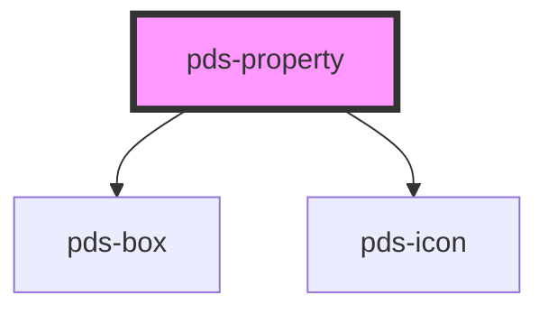

# pds-property

<!-- Auto Generated Below -->

## Properties

| Property      | Attribute      | Description                                                           | Type     | Default     |
| ------------- | -------------- | --------------------------------------------------------------------- | -------- | ----------- |
| `componentId` | `component-id` | A unique identifier used for the underlying component `id` attribute. | `string` | `undefined` |
| `icon`        | `icon`         | The name of the icon to display before the property text.             | `string` | `undefined` |

## Slots

| Slot          | Description                |
| ------------- | -------------------------- |
| `"(default)"` | The property text content. |

## Dependencies

### Depends on

- [pds-box](../pds-box)
- pds-icon

### Graph

----------------------------------------------

