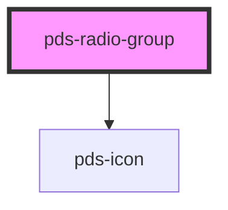

# pds-radio-group

<!-- Auto Generated Below -->

## Properties

| Property        | Attribute        | Description                                                                                                                                             | Type                | Default     |
| --------------- | ---------------- | ------------------------------------------------------------------------------------------------------------------------------------------------------- | ------------------- | ----------- |
| `componentId`   | `component-id`   | A unique identifier used for the underlying component `id` attribute.                                                                                   | `string`            | `undefined` |
| `direction`     | `direction`      | Layout direction for the radio group.                                                                                                                   | `"column" \| "row"` | `'column'`  |
| `disabled`      | `disabled`       | Determines whether or not the radio group is disabled.                                                                                                  | `boolean`           | `false`     |
| `errorMessage`  | `error-message`  | Displays error message text describing an invalid state for the entire group.                                                                           | `string`            | `undefined` |
| `gap`           | `gap`            | Spacing between radio items. Accepts t-shirt sizes (none, xxs, xs, sm, md, lg, xl, xxl) or core spacing tokens (025, 050, 100, etc.).                   | `string`            | `'xs'`      |
| `groupLabel`    | `group-label`    | String used for group label/heading.                                                                                                                    | `string`            | `undefined` |
| `helperMessage` | `helper-message` | Displays helper message text below the radio group.                                                                                                     | `string`            | `undefined` |
| `invalid`       | `invalid`        | Determines whether or not the radio group is invalid.                                                                                                   | `boolean`           | `false`     |
| `name`          | `name`           | String used for radio `name` attribute. Applied to all child radios. Required for proper radio group behavior (mutual exclusivity and form submission). | `string`            | `undefined` |
| `required`      | `required`       | Determines whether or not the radio group is required.                                                                                                  | `boolean`           | `false`     |

## Events

| Event                 | Description                                                                                 | Type                                       |
| --------------------- | ------------------------------------------------------------------------------------------- | ------------------------------------------ |
| `pdsRadioGroupChange` | Emits when a radio in the group is selected, providing the selected value and component ID. | `CustomEvent<RadioGroupChangeEventDetail>` |

## Slots

| Slot          | Description                |
| ------------- | -------------------------- |
| `"(default)"` | Child pds-radio components |

## Dependencies

### Depends on

- pds-icon

### Graph

----------------------------------------------

