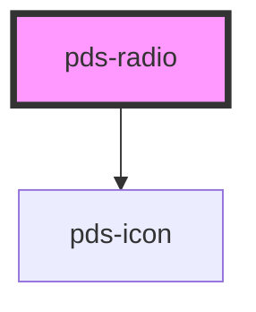

# pds-radio

<!-- Auto Generated Below -->

## Properties

| Property                   | Attribute        | Description                                                                                                                                                    | Type      | Default     |
| -------------------------- | ---------------- | -------------------------------------------------------------------------------------------------------------------------------------------------------------- | --------- | ----------- |
| `checked`                  | `checked`        | Determines whether or not the radio is checked.                                                                                                                | `boolean` | `false`     |
| `componentId` _(required)_ | `component-id`   | A unique identifier used for the underlying component `id` attribute and the label `for` attribute.                                                            | `string`  | `undefined` |
| `disabled`                 | `disabled`       | Determines whether or not the radio is disabled.                                                                                                               | `boolean` | `false`     |
| `errorMessage`             | `error-message`  | Displays error message text describing an invalid state.                                                                                                       | `string`  | `undefined` |
| `hasBorder`                | `has-border`     | Adds a border around the radio component for better visual separation.                                                                                         | `boolean` | `false`     |
| `helperMessage`            | `helper-message` | Displays helper message text below radio.                                                                                                                      | `string`  | `undefined` |
| `hideLabel`                | `hide-label`     | Visually hides the label text for instances where only the radio should be displayed. Label remains accessible to assistive technology such as screen readers. | `boolean` | `undefined` |
| `invalid`                  | `invalid`        | Determines whether or not the radio is invalid.                                                                                                                | `boolean` | `false`     |
| `label`                    | `label`          | String used for label text next to radio.                                                                                                                      | `string`  | `undefined` |
| `name`                     | `name`           | String used for radio `name` attribute.                                                                                                                        | `string`  | `undefined` |
| `required`                 | `required`       | Determines whether or not the radio is required.                                                                                                               | `boolean` | `false`     |
| `value`                    | `value`          | The value of the radio that is submitted with a form.                                                                                                          | `string`  | `undefined` |

## Events

| Event            | Description                                                                        | Type                   |
| ---------------- | ---------------------------------------------------------------------------------- | ---------------------- |
| `pdsRadioChange` | Emits a boolean indicating whether the checkbox is currently checked or unchecked. | `CustomEvent<boolean>` |

## Slots

| Slot      | Description                                                        |
| --------- | ------------------------------------------------------------------ |
| `"image"` | Custom image content to display instead of the default radio input |

## Shadow Parts

| Part                | Description                 |
| ------------------- | --------------------------- |
| `"image-container"` | The container for the image |

## Dependencies

### Depends on

- pds-icon

### Graph

----------------------------------------------

