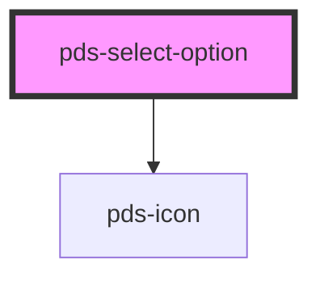

# pds-select-option

<!-- Auto Generated Below -->

## Properties

| Property      | Attribute      | Description                              | Type      | Default     |
| ------------- | -------------- | ---------------------------------------- | --------- | ----------- |
| `componentId` | `component-id` | The id for the option                    | `string`  | `undefined` |
| `selected`    | `selected`     | Sets the state of the option to          | `boolean` | `undefined` |
| `text`        | `text`         | The text to be displayed in the option   | `string`  | `undefined` |
| `value`       | `value`        | The value of that is saved for form data | `string`  | `undefined` |

## Events

| Event                     | Description                         | Type               |
| ------------------------- | ----------------------------------- | ------------------ |
| `pdsSelectOptionSelected` | Triggered when an option is clicked | `CustomEvent<any>` |

## Dependencies

### Depends on

- pds-icon

### Graph

----------------------------------------------

